# Exercise 01: Create an SAP account and configure SAP resources

## Scenario
In this exercise, you'll create an SAP account. You'll also create an account so that you can access the SAP Gateway Demo system. The Gateway Demo system serves as the SAP data source for this lab. 

## Objectives
After you complete this exercise, you'll be able to:
- Create an SAP account.
- Configure access to the SAP Gateway Demo system.

## Duration

**Estimated time**: 10-15 minutes

---

## Task 01: Create an SAP account

### Introduction

AP controls access to demos and documentation. You need to create an account before you can access the SAP Gateway Demo system data.

### Description

In this task, you create an account so that you can access SAP resources.

### Success criteria

- You receive an email from SAP that includes the URI and credentials to access the SAP Gateway Demo system.
- You successfully connect to the AP Gateway Demo system. 

### Learning resources

-   [SAP Home page](https://www.sap.com/index.html "SAP Home page")

### Key tasks

#### 01: Create the SAP account

 
  
<strong>Expand this section to view the solution</strong>
 

1. Open Edge and go to [SAP page](https://www.sap.com).

1. At the upper right of the page, select the Sign in icon. 

    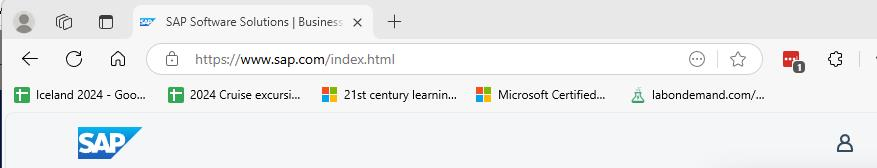

    {: .note }
	> If the **Sign in** icon is not visible, select the **&#9776;** icon.
    > 
	> 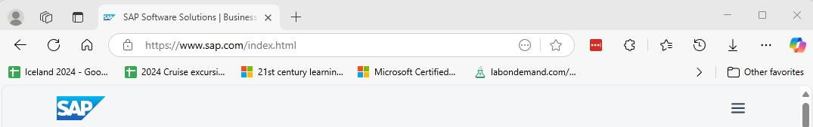

1. In the **Login or create an SAP account** dialog, select **Create your SAP account**.

    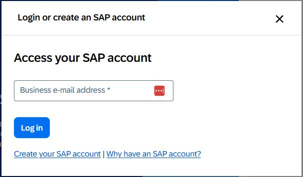

1. Enter the following information on the **Register** page of the **We see you're new to SAP** dialog:

    | Field | Value |
    |:---------|:------|
    | First name| `Admin` |
    | Last name |`User`   |
    | Country/Region   | Select your country/region   |
    | Business e-mail address   | Enter your work or personal email address   |
    | Company  | `Contoso`   |
    | Department   | **Training**   |
    | Relationship to SAP  | **Student**   |

1. Select the **I have read and understood the Terms and Conditions of SAP.com** checkbox and then select **Submit**.

    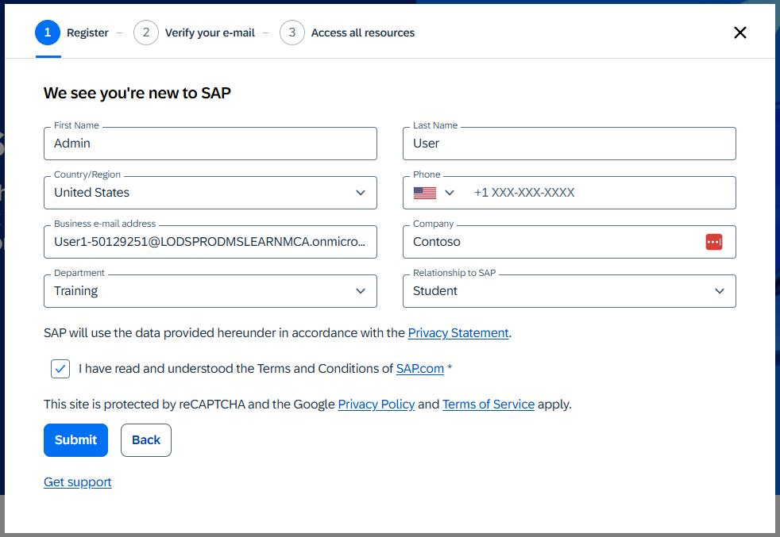

1. If prompted, complete the Captcha process.

1. Wait for the **Verify your e-mail** page of the **We see you're new to SAP** dialog to display.

    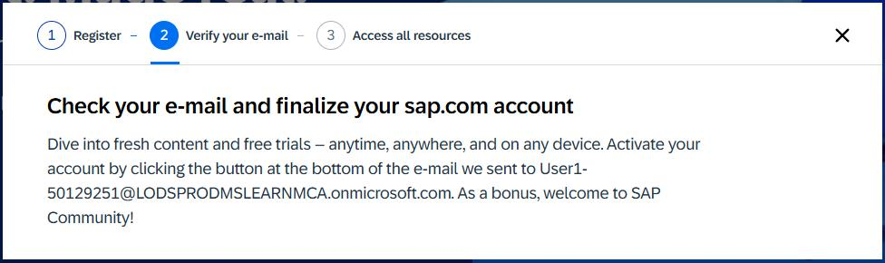

1. Open your email app and go to the inbox. Locate an email from the sender **SAP Universal ID - Notification**.

    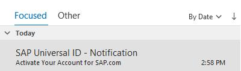

1. Open the email. Locate the hyperlink below the **Click to activate your account** button.

    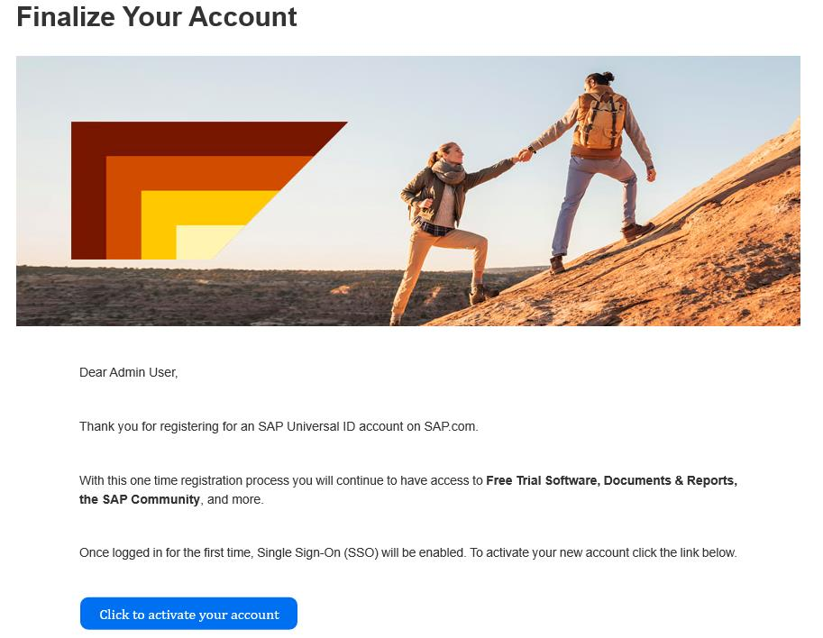

1. Copy the link and then paste it into a notepad document for later use.

    {: .warning }
	> After pasting the value into the text field, select the **Tab** key, or select any element outside of the text field. This ensures that the value is saved for use later in the lab.

1. Return to the lab environment. Open a new browser window and go to `@lab.Variable(SAPActivationLink)`.

1. In the **Finalize your account** dialog, enter `your SAP portal password`, confirm it to proceed.
 

1. Select the **I acknowledge that I have read the SAP Universal ID Terms of Use** checkbox and then select **Submit**.

    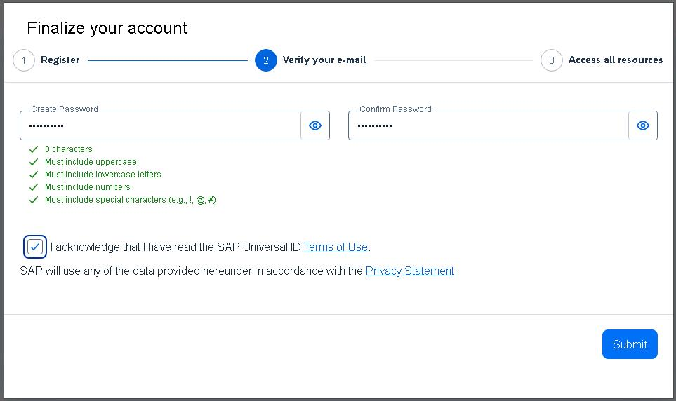

1. On the **SAP ID Service** Sign in page, enter the following email address and then select **Continue**. Then enter a `SAP portal username`  

    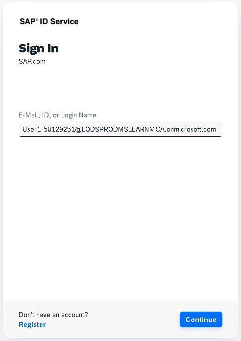

1. Wait for the **Thank you!** page to display.

     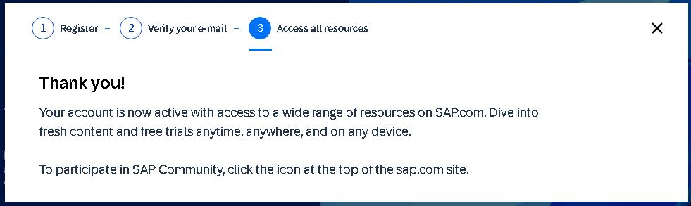

1. Close the **Thank you** dialog.

---

## Task 02: Create an account for the SAP Gateway Demo system

### Introduction
Now that you can access SAP resources, you must create an account to access demo data.

### Description

In this task, you sign in to the SAP developer site and create an account. The account provides access to the SAP Gateway Demo system. At the end of the process, you open the Fiori Launchpad app

### Success criteria

- You have valid credentials to use the SAP Gateway demo system
- You can open the Fiori Launchpad app. This app provides an environment where you can run SAP applications to explore data.

### Learning resources
-   [Create an account on the SAP Gateway Demo system](https://developers.sap.com/tutorials/gateway-demo-signup..html "SAP Gateway Demo system")
-   [SAP on Microsoft Labs](https://abicas.github.io/SapOnMicrosoftDemos/ "SAP on Microsoft Labs")
-   [Fiori Launchpad User Guide](https://help.sap.com/docs/btp/sap-fiori-launchpad-for-sap-btp/sap-fiori-launchpad-user-guide "Fiori Launchpad User Guide")

### Key tasks

#### 01: Register on SAP Gateway Demo server

 
  
<strong>Expand this section to view the solution</strong>
 

1. Open a new browser window and go to [SAP Gateway Demo Server](https://register.sapdevcenter.com/SUPSignForms/). 

1. If prompted, sign in by using the following credentials: 

    Username: `your SAP portal username`  
    Password: `your SAP portal password`   

1. On the **SAP Gateway Demo Server -ES5** page that displays, copy the User ID value to the Windows clipboard and paste then in a notepad file for future use.

1. On the **SAP Gateway Demo Server -ES5** page, select the **I have read and understood the Terms and Conditions** checkbox and then select **Register**. 

    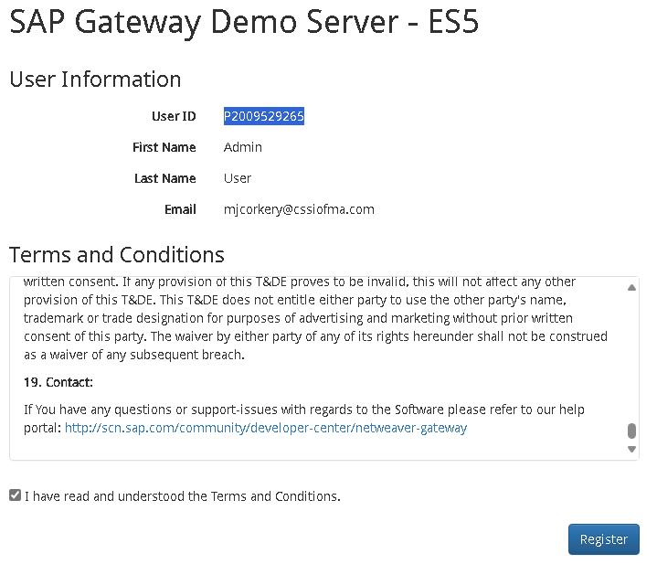

1. You should see a new page display. The page will report that the registration is being processed.

1. Select **Show password**. Paste the temporary password into a notepad for future use.

    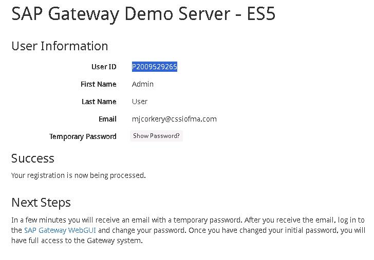

    {: .note }
    > The SAP system will send you an email that includes the Server URI, username, and initial password.

1. Open a new browser window and go to the [SAP WebGUI](https://sapes5.sapdevcenter.com/sap/bc/gui/sap/its/webgui).

1. On the **SAP NetWeaver** page that opens, enter the following credentials and then select **Log on**:

    |       |          |
    |:------|:-------------------------------|
    | Username: | Your SAP Gateway Demo system user ID  | 
    | Password: | You SAP Gateway Demo system temporary password |
    
    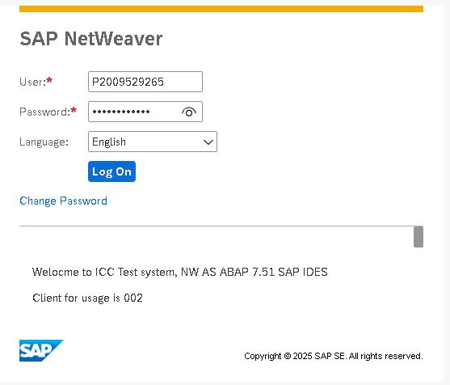

1. On the **SAP NetWeaver** page that displays, enter the following information to replace the temporary password and then select **Change**:

    |       |          |
    |:------|:-------------------------------|
    | Current Password: | `the SAP Gateway Demo system temporary password`  | 
    | New Password: | `your SAP portal password` |  
    | Repeat Password: | `your SAP portal password` |  

    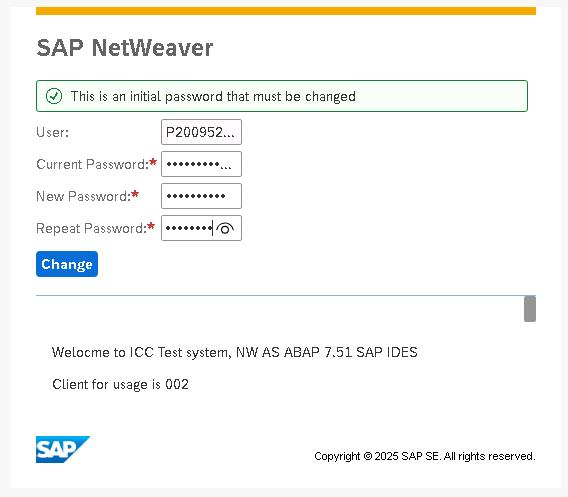

1. On the SAP NetWeaver page that displays, verify that the password was changed successfully and then select **Continue**.

    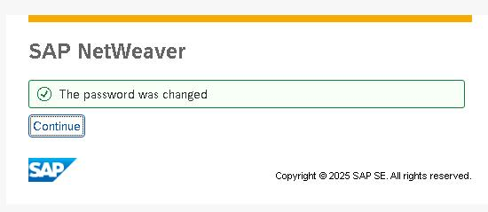
    
1. The **You have successfully logged on to the Gateway Demo System** page displays. Right-click the **Fiori Launchpad** link and then select **Copy link**.

    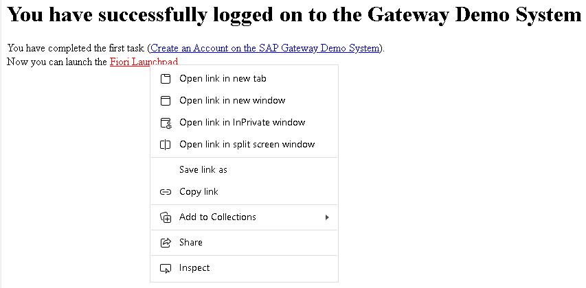

1. Copy the link then paste it into a notepad document for later use.

1. Select the Fiori Launchpad link to start the app.

    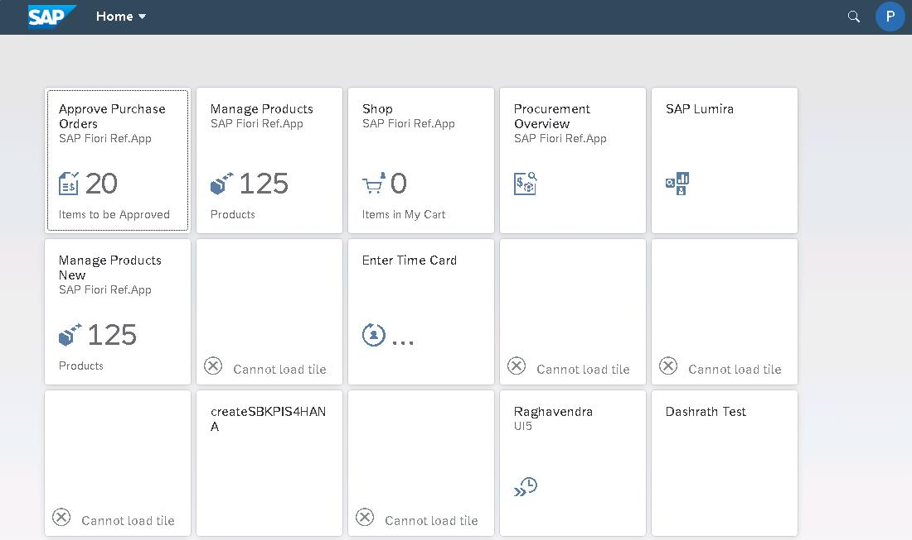

