# Exercise 02: Create and configure resources

In this exercise, you'll create a pipeline in Microsoft Fabric to extract data from the SAP Gateway Demo system into a lakehouse. You'll create relationships between the lakehouse tables.

## Architecture

The OData connection that you'll use in this lab fetches data that relates to customers, sales orders, and products. The source includes over a dozen tables. 

For this lab, you'll be working with a subset of the tables. The diagram below shows the tables you'll use and the relationships between the tables. For simplicity, the diagram omits columns that are present in each table.

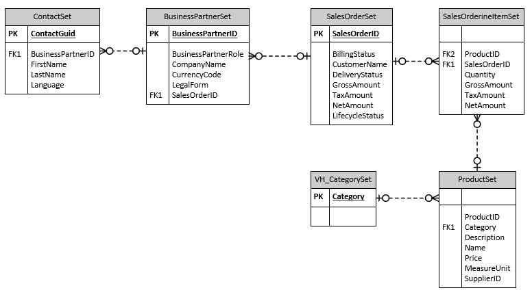

{: .warning } 
> This lab requires that Fabric capacity is assigned to the user account provisioned for this lab. When you get to Exercise 02, Task 01, Step 11, if you don't see that Fabric capacity is assigned, please alert your coach.

## Objectives
After you complete this exercise, you'll be able to:

-   Create a Microsoft Fabric workspace
-   Create a pipeline activity
-   Configure the pipeline to use the Copy Data assistant
-   Run the pipeline
-   Configure the lakehouse tables
-   Create an Azure OpenAI resource and deploy a model

## Duration
**Estimated time**: 15-20 minutes

---

## Task 01: Sign in to the Microsoft Fabric website and create a workspace

### Introduction

In the previous exercise you created accounts so that you can access the SAP Gateway Demo system. Now you need to import some sample data into a Microsoft Fabric lakehouse. Later in the lab, you'll create a Copilot agent that uses the data in the lakehouse as a knowledge source to answer questions from users.

### Description

In this task, you configure access to Microsoft Fabric and create a workspace. The workspace organizes all resources that relate to a project. 

### Success criteria

-   You've signed in to the Microsoft Fabric website
-   You've created a workspace
-   The workspace uses Fabric capacity

### Learning resources

-   [Microsoft Fabric Overview](https://learn.microsoft.com/en-us/fabric/ "Microsoft Fabric Overview")
-   [Workspaces in Microsoft Fabric and Power BI](https://learn.microsoft.com/en-us/fabric/fundamentals/workspaces "Workspaces in Microsoft Fabric and Power BI")

### Key tasks

#### 01: Launch Power BI Fabric

 
  
<strong>Expand this section to view the solution</strong>

1. Open a new browser window and go to [Power BI](https://app.powerbi.com).

    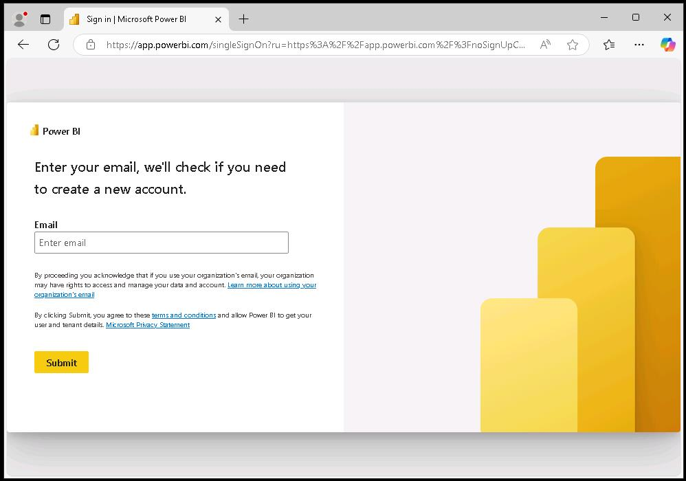

1. If prompted, sign in by using the following credentials:

    |   |   |
	|:--|:--|
	|Username: | `your SAP portal username` | 
    |Password: | `your SAP portal password` |

1. On the Fabric home page, in the left pane, select **Workspaces**.

    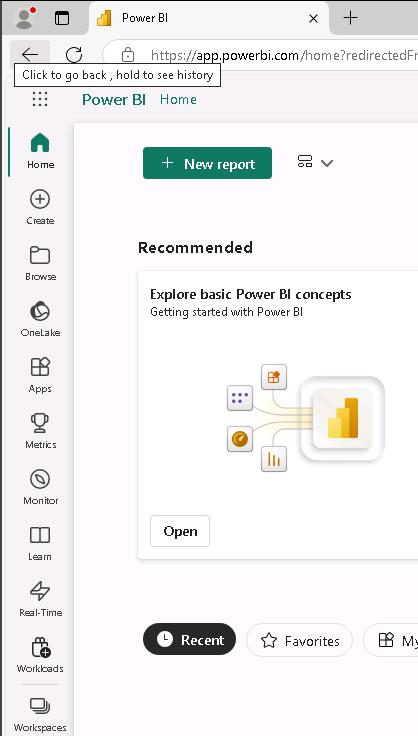

1. Select **New workspace**.

    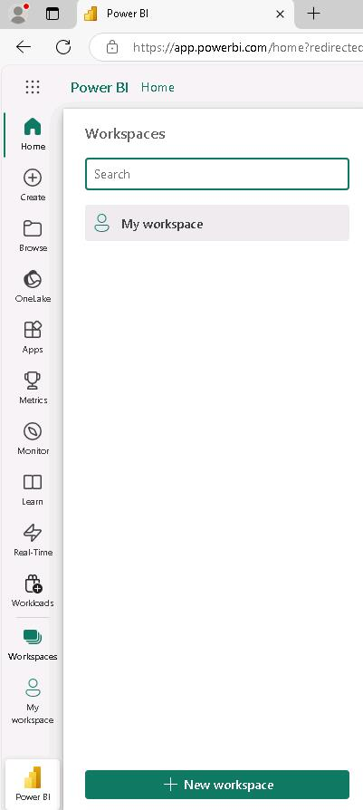

1. In the **Name** field, enter `SapWS@lab.LabInstance.Id`.

    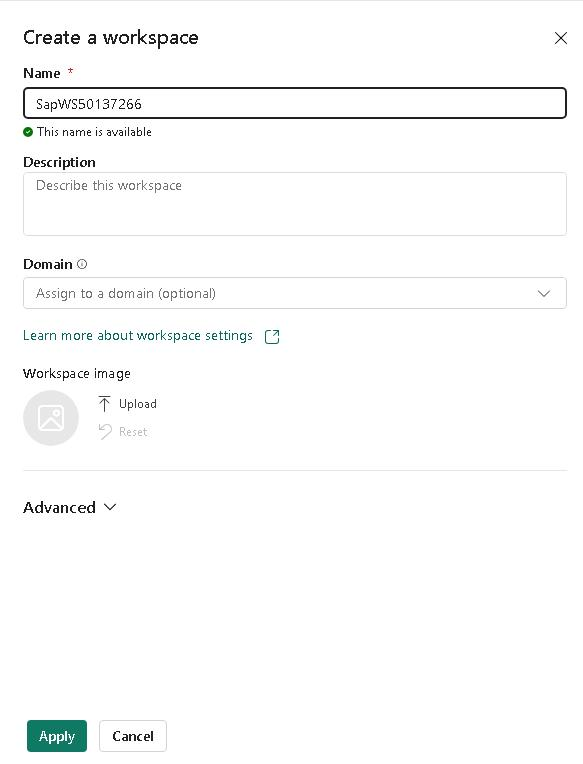

1. Select **Advanced** to expand the node. Verify that **Fabric capacity** is selected and then select **Apply**.  

    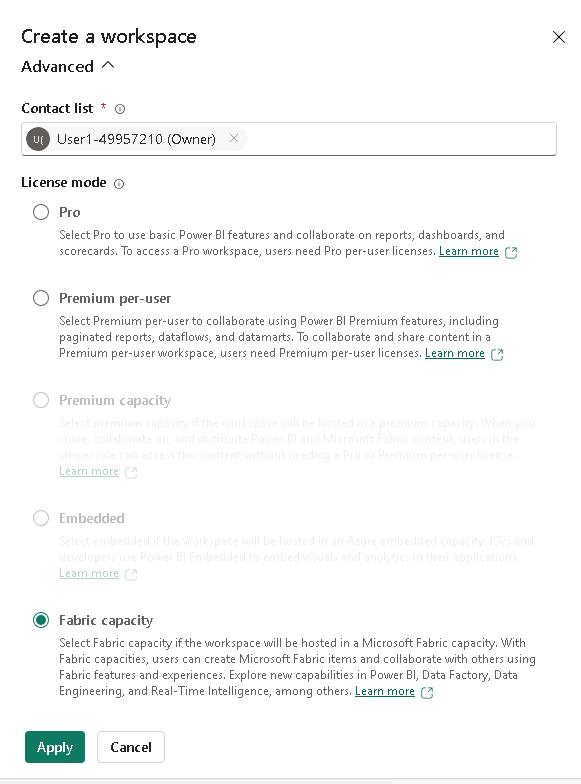

    {: .warning } 
	> Please alert your coach if the **License mode** is set to anything other than **Fabric capacity**.

1. The **SapWS@lab.LabInstance.Id** workspace page displays.

    

1. Leave the **SapWS@lab.LabInstance.Id** workspace page open. You'll perform additonal steps in the workspace in Task 02.

---

## Task 02: Create a data pipeline

### Introduction

Microsoft Fabric provides many methods for ingesting data. You can create data flows, copy jobs, and pipelines. The choice of which method to use is based on your needs. For example, if you need to transform data during ingestion, data flows are your best bet. For this lab, you'll use a data pipeline. The pipeline allows you to easily ingest data at scale.

### Description

In this task, you'll create a pipeline activity within the workspace that uses the Copy data assistant to configure a connection to the SAP Gateway Demo system data store. The Copy Data assistant also creates a lakehouse as a destination for the copied data. You'll use an OData connector to establish a connection with the SAP Gateway demo system.

### Success criteria

-   The data pipeline run successfully completes.

### Learning resources

-   [Create your first pipeline](https://learn.microsoft.com/en-us/fabric/data-factory/create-first-pipeline-with-sample-data "Create your first pipeline")
-   [Move and transform data with dataflows and data pipelines](https://learn.microsoft.com/en-us/fabric/data-factory/transform-data "Move and transform data with dataflows and data pipelines")
-   [OData Overview](https://learn.microsoft.com/en-us/odata/overview "OData Overview")

### Key tasks

#### 01: Initialize the pipeline

 
  
<strong>Expand this section to view the solution</strong>

1. At the upper left of the SapWS@lab.LabInstance.Id workspace page, select **+ New item**.

    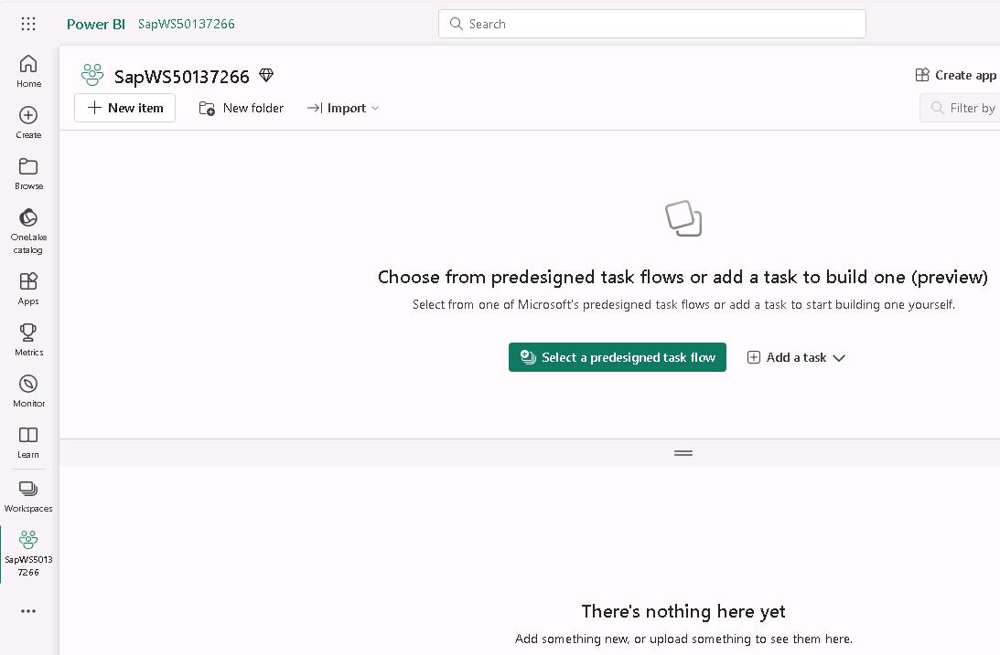

1. In the **New item** pane, move through the list to the **Get data** section and select the **Data pipeline** tile.

    

1. In the **New pipeline** dialog that displays, enter `SapDataPipeline@lab.LabInstance.Id` and then select **Create**. 

    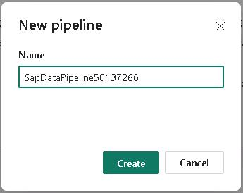

1. On the **Build a data pipeline...** page, select **Copy data assistant**.

    {: .note }
	> The Copy Data assistant steps you through the process of connecting to source data, selecting the data that you want to ingest, selecting your destination, and then running the pipeline.

    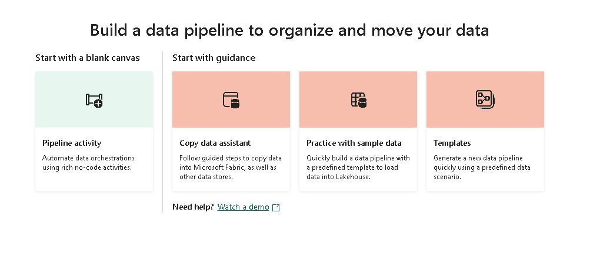

1. On the **Choose data source** page of the **Copy data** tool, enter `OData` in the Search field and select the **OData** tile in the list of results.

    {: .note }
	> Fabric provides a wide variety of connectors so that you can access data from many sources.

    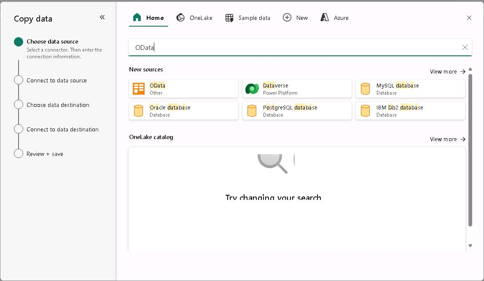

1. On the **Connect to a data source** page of the **Copy data** tool, enter the values from the following table and then select **Next**. Leave all other options at default settings.

    | Field | Value |
    |:---------|:--------  |
    | URL   | `https://sapes5.sapdevcenter.com/sap/opu/odata/iwbep/GWSAMPLE_BASIC`   |
    | Authentication kind   | **Basic**   |
    | Username   | `the SAP Gateway Demo system user ID`    |
    | Password   | `your SAP portal password` |

    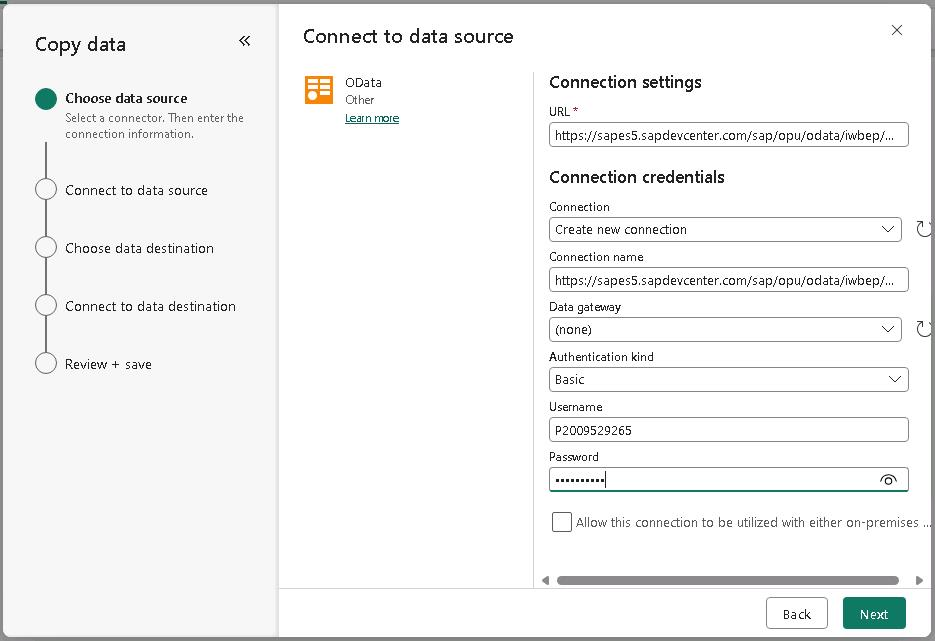

    {: .warning }
	> It may take several minutes for the tool to connect to the data source and retrieve a list of tables.

    {: .note }
	> The URL provides the path to the GWSAMPLE_BASIC dataset that you'll use for this lab. You generated the user name in Exercise 01, Task 02 when you set up an SAP devcenter account. The SAP Gateway Demo system provides 16 tables for the connection that you're using in this lab. You'll only use six tables for this lab.

1.  On the **Connect to a data source** page of the **Copy data** tool, select the following six tables and then select **Next**:

    - **BusinessPartnerSet**
    - **ContactSet**
    - **ProductSet**
    - **SalesOrderLineItemSet**
    - **SalesOrderSet**
    - **VH_CategorySet**

    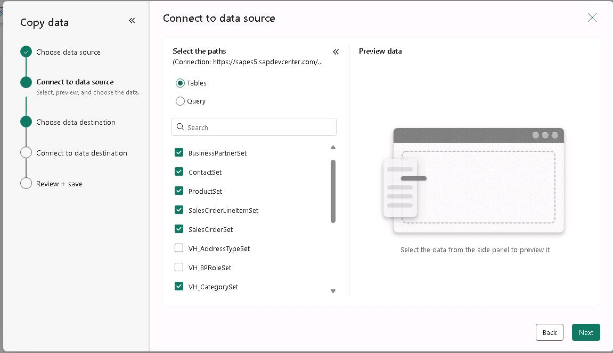

1. On the **Choose data destination** page of the **Copy data** tool, select the **Lakehouse** tile.

    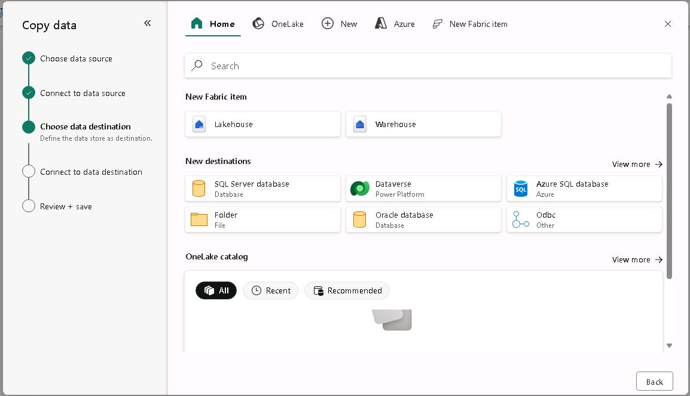

1. In the **New lakehouse** dialog, enter `SapLH@lab.LabInstance.Id` in the **Name** field and then select **Create and connect**.

    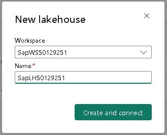

#### 02: Map, save, and run

 
  
<strong>Expand this section to view the solution</strong>

1. On the **Connect to data destination** page of the **Copy data** tool, select **BusinessPartnerSet**. Verify that the value for the **Load settings** field is **Load to new table**. Repeat this process for the other five columns. 

    {: .warning }
	> When the **Connect to data destination** page first displays, table metadata is still being loaded into memory. If you see a message stating that tables are loading please wait a few moments for the process to complete and then repeat the step.
        
    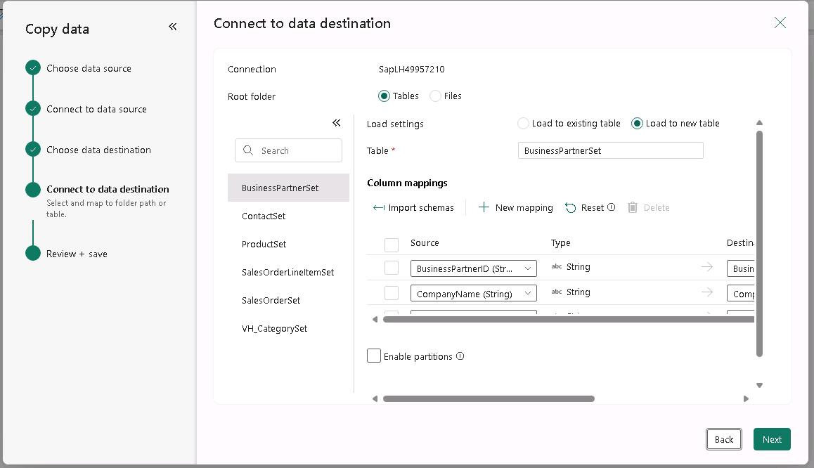

1. On the **Connect to data destination** page of the **Copy data** tool, select **Next**.

    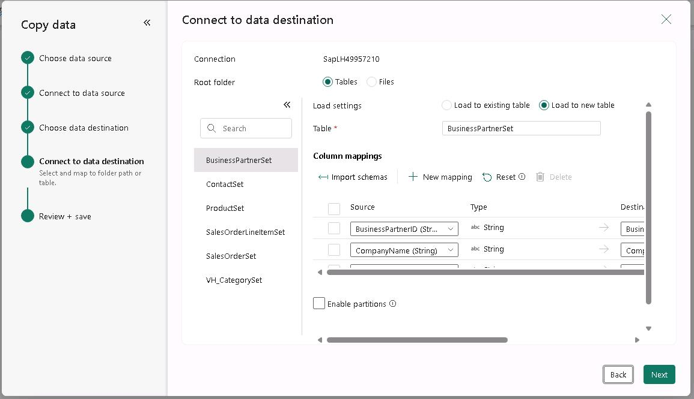

    {: .warning }
	> If you see error messages stating that tables are not loaded or that column mapping is required, wait a few moments and repeat Step 7. The tool should automatically load all tables and correctly map all columns. 
    >
	> 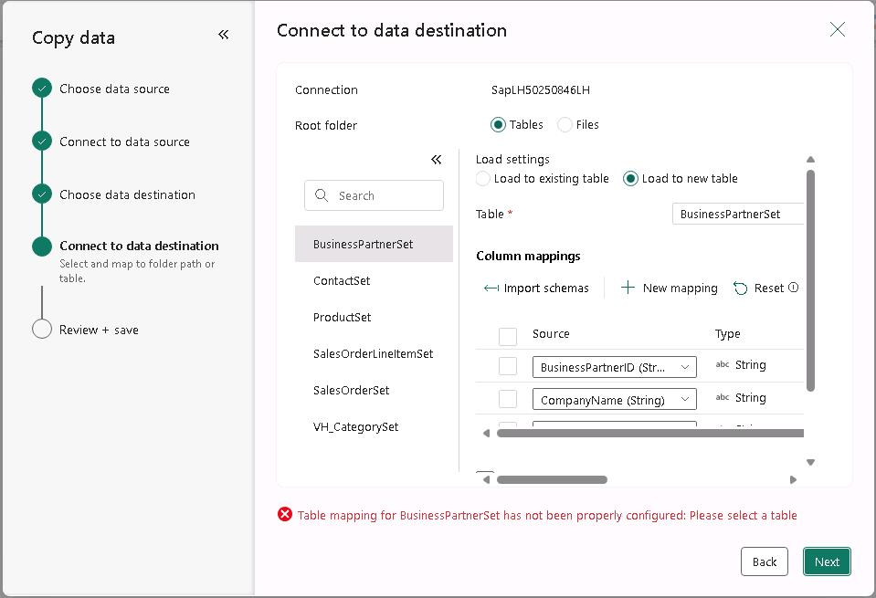

1. On the **Connect to data destination** page of the **Copy data** tool, select **Save + Run**. 

    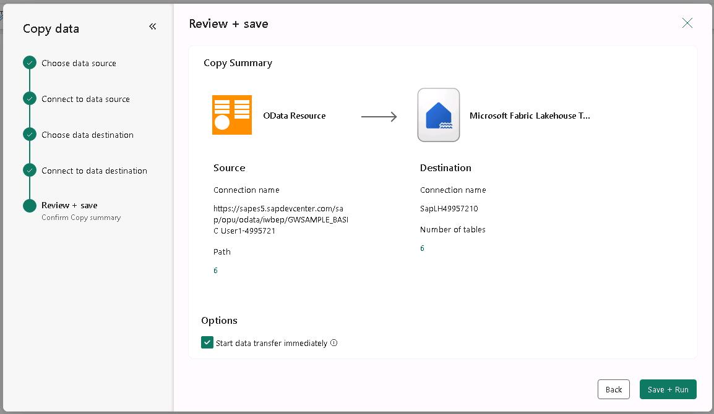

1. The **SapDataPipeline@lab.LabInstance.Id** page displays.

    {: .note }
	> The tool creates a ForEach activity that cycles through each of the data source tables. For each table, the tool runs a **Copy** activity to fetch the data for the table. The tool automatcially names activities and objects.

    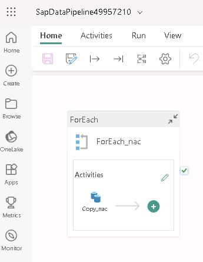

1. In the pipeline run pane that displays, select **OK**. This tells the tool to start the pipeline execution.

    

    {: .note }
	> During testing, the average time to load data for all six tables was 3-5 minutes. At the bottom of the SapDataPipeline@lab.LabInstance.Id page, you'll see a list of the activities. An **Activity Status** field shows the progress for each activity. The status for each activity changes from **Queued** to **In progress** and finally to **Succeeded**.

1. If necessary, drag the horizontal splitter bar up so that you can see the **Details** pane that appears at the bottom of the page.

    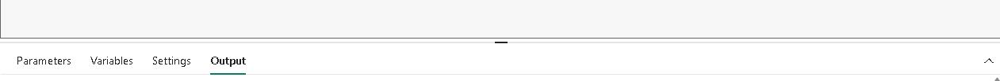

1. At the bottom of the **SapDataPipeline@lab.LabInstance.Id** page, verify that the value for each Activity status field is **Succeeded**.

    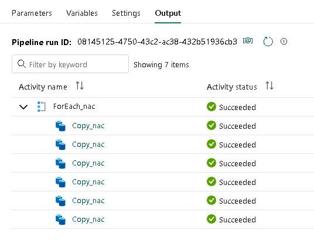

