# Exercise 03: Create, configure, and test a Copilot agent
A Copilot agent will act as the interface between a user and the SAP data. In this exercise, you'll create and configure a Copilot agent. You'll then test the agent.

## Architecture

For this lab you will create a topic for the Copilot agent. When a user enters a prompt in the agent, the topic is triggered. The following diagram shows the process that occurs. The topic starts a Power Automate flow. The flow makes a call to the Azure OpenAI resource that you provisioned earlier to convert the users request into a Data Analysis Expressions (DAX) query. The DAX query is passed to a Power BI connector which connects to the lakehouse where the data is stored. 

After the query is executed the results are sent to Azure OpenAI for summarization and formatting. The final results are sent back to the Copilot agent as a response.

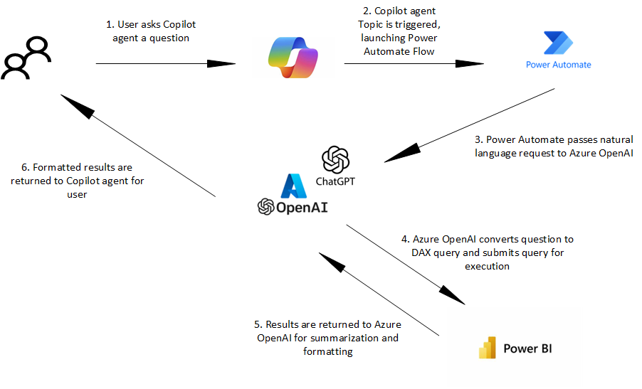

## Objectives
After you complete this exercise, you'll be able to:

-   Create a Copilot agent
-   Create a topic for the agent
-   Create a Power Automate flow for the topic
-   Test the agent

## Duration
**Estimated time**: 25-30 minutes

---

## Task 01: Create a Copilot agent
<!--Task 01 duration ~4 minutes-->

### Introduction

You've already ingested data from SAP into a Fabric lakehouse. Now, you need a way to query the data. A user will enter a business question about the data as a prompt to the Copilot agent. The agent will then use the prompt to query the data and return a response.

## Description

 In this task, you'll answer a set of prompts to create a Copilot agent.

### Success criteria

-   You've created a Copilot agent by answering a series of prompts.

### Learning resources

-   [Build Copilot agents](https://learn.microsoft.com/en-us/microsoft-365-copilot/extensibility/copilot-studio-agent-builder-build "Build Copilot agents")

### Key tasks

#### 01: Access Copilot Studio and create the agent

<details markdown="block"> 
  <summary><strong>Expand this section to view the solution</strong></summary>

{: .warning } 
> For the steps in this task, you provide information to help create the Copilot agent. Please remember that Copilot agents are evolving very fast. The number of questions that you're asked and the order in which the questions are presented may differ from what you see in these steps.

1. Open a new browser tab and go to [Copilot Studio](www.copilotstudio.com).

1. Select your country/region and then select **Start free trial**.

    {: .note }
	> After you select **Start free trial**, there may be a delay before the next screen displays.

1. In the **Welcome to Copilot Studio** dialog, select **Skip**.

    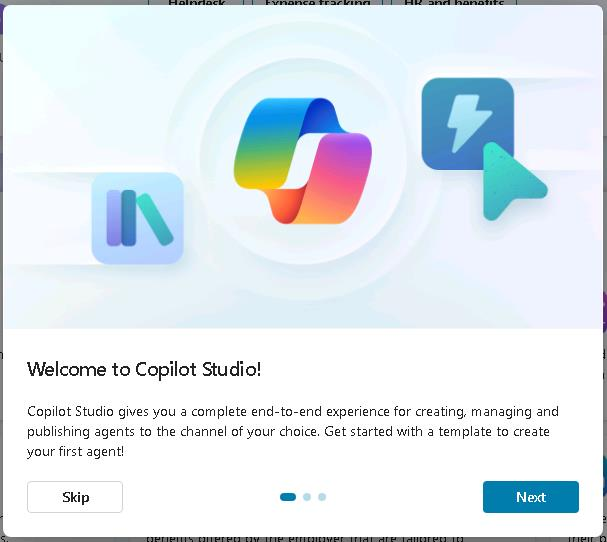

1. If prompted, sign in by using the following credentials:

    Username: `your SAP portal username`  
    Password: `your SAP portal password` 

1. In the left navigation pane for Copilot Studio, select **Create**.

    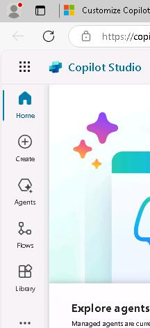

1. On the **Create** page, select **+ New agent**.

    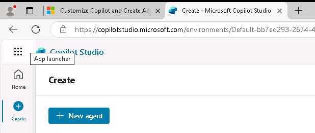

    {: .warning }
    > An error message which resembles the following screenshot may display. The error message often indicates that the system is still initializing. If you see this error messages, return to the previous page, wait a couple of minutes, and select **+ New agent** again.

    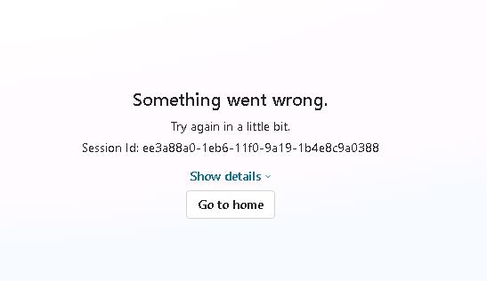


1. In the **Type your message** field, enter the following text and then select **Send**. Wait for Studio to load a response to your prompt.

    ```
	Create an agent that allows users to interact with Product, Sales, and Customer information that was ingested from SAP into a Microsoft Fabric lakehouse.
	```

    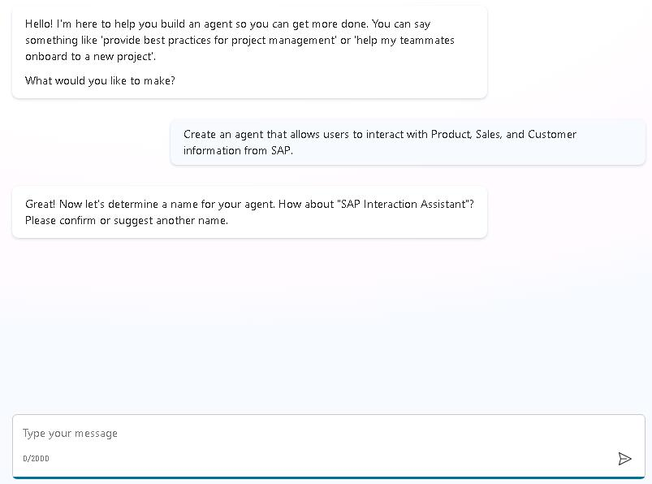

1. In the *Type your message* field, enter the following text and then select **Send**. Wait for Studio to load a response to your prompt.

    ```
	Use the name "SAP Agent".
	```

    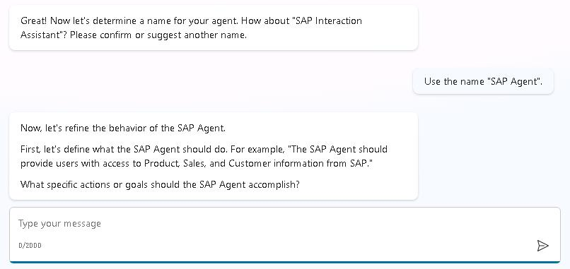
    
1. In the **Type your message** field, enter the following text and then select **Send**. This prompt represents some common business questions that users may ask. Wait for Studio to load a response to your prompt.

    ```
	Allow users to count the number of orders for each customer and the total GrossAmount, TaxAmount, and NetAmount for each customer.
	Allow users to identify which categories of products a customer has purchased.
	Allow users to determine which orders are not yet delivered.
	Allow users to determine the average price for products in a given category.
	```

    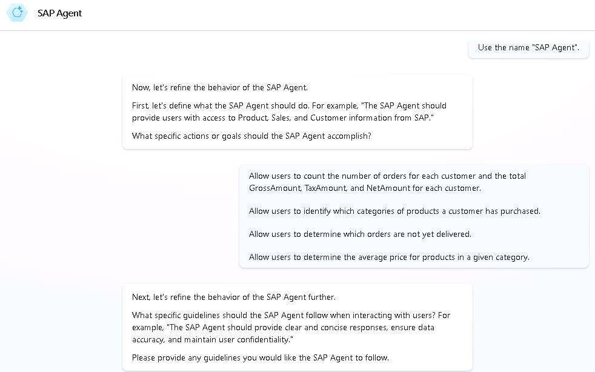

1. In the **Type your message** field, enter the following text and then select **Send**. Wait for Studio to load a response to your prompt.

    ```
	Don't use publicly accessible data sources. Only use data from the Microsoft Fabric lakehouse that we'll specify.
	```

    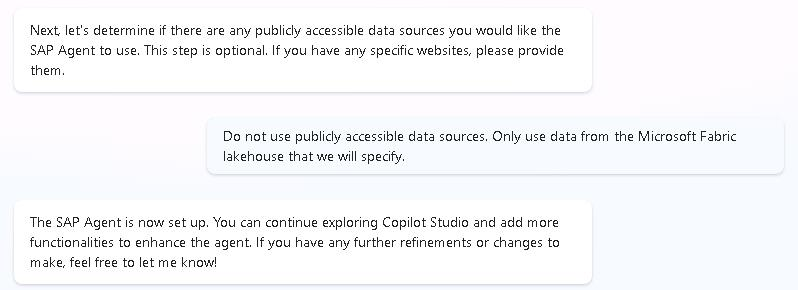
    

1. At the upper right of the Copilot Studio page, select **Create**.

    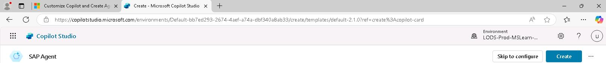

    {: .note }
	> It may take a few minutes to set up your agent.

</details>

---

## Task 02: Configure the agent

### Introduction

You've successfully created a Copilot agent and created a lakehouse in Fabric. Now, you need to connect the agent to the data from SAP. 

In the near future you'll have many more ways to connect a Copilot agent to data. These include connecting the Copilot agent to a Fabric agent which in turn connects to the data.

### Description

In this task, you will create a topic that runs a Power Automate flow to retrieve data from the Fabric lakehouse.

### Success criteria

-   You've created and published a Power Automate flow
-   You've created a topic that uses the Power Automate flow

### Learning resources

-   [Create and edit topics](https://learn.microsoft.com/en-us/microsoft-copilot-studio/advanced-flow-create "Create Power Automate flows")
-   [Create Power Automate flows](https://learn.microsoft.com/en-us/microsoft-copilot-studio/authoring-create-edit-topics?tabs=webApp "Create and edit topics")

### Key tasks

#### 01: Define the topic and triggers

<details markdown="block"> 
  <summary><strong>Expand this section to view the solution</strong></summary>

1. In Copilot Studio, in the menu bar for SAP Agent, select **Topics**.

    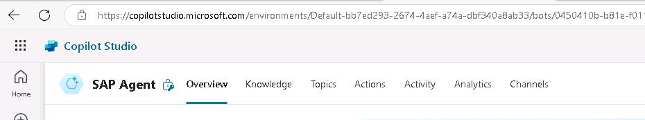.

1. Select **+ Add a topic** and then select **From blank**.

    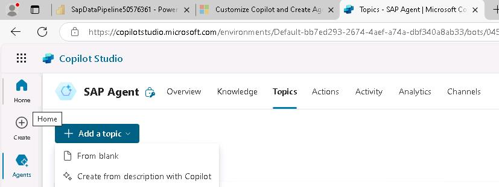

1. At the upper left of the **SAP Agent** page, select **Untitled**. Replace the selected text with `AnswerUserQuestions` and then select the Enter key.
    
    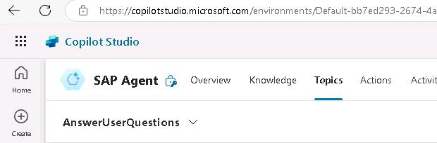

1. In the **Trigger** activity, in the Phrases section, select **Edit**.

    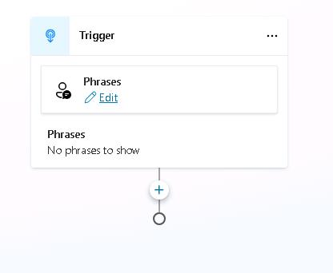

1. In the **Phrases pane**, enter `Show me all sales orders for a customer` and then select **+** to add the phrase.

1. Repeat Step 5 to add each of the following phrases:

    - `Retrieve sales order details for a customer.`
    - `Get all line items for orders placed by a customer.`
    - `I need a list of sales orders and items for a customer.`
    - `Fetch sales order history for a customer.`
    - `Pull all sales transactions for a customer.`

    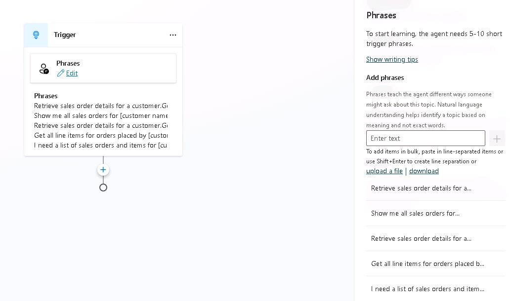

    {: .note }
	> The phrases help the Copilot agent understand the different ways that users can ask for the same information. 

1. Close the Phrases pane by selecting the **X** at the upper right of the Phrases pane.

    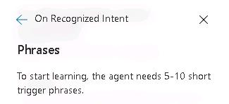

</details>

#### 02: Build the Power Automate flow

<details markdown="block"> 
  <summary><strong>Expand this section to view the solution</strong></summary>

1. Select the **Add node** icon (**+**) under the Trigger activity and then select **Ask a question**.

    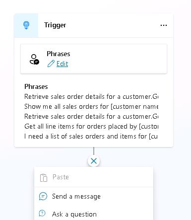

1. In the **Enter a message** field, enter `What is the name of the customer?`.


1. Select the **Identify** field. In the **Choose information to identify** pane, select **Organization**.

    {: .note }
	> You may need to select the arrow (**>**) in the Identify field twice to see the **Choose information to identify** pane.

    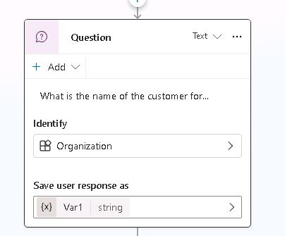

1. In the **Save user response as** field, select **Var1**. 

1. In the **Variable properties** pane, in the Variable name field, type `SelectedCustomerName`. Close the **Variable properties** pane. 

    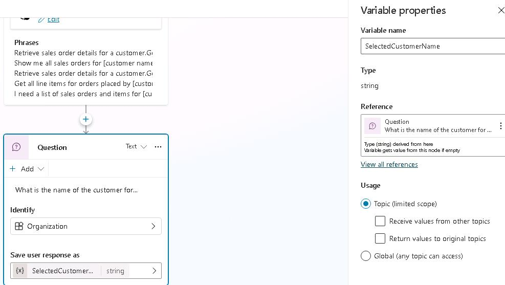

1. Close the **Properties** pane.

1. Select the **Add node** icon (**+**) under the Question activity. Select **Add an action** and then select **New Power Automate flow**.

    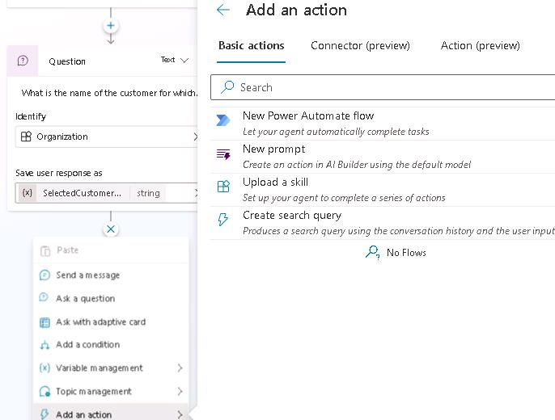

1. At the upper left of the Power Automate window, select **When an agent calls the flow**. Replace the selected text with `FlowforSapAgent` and then select **Enter**.

    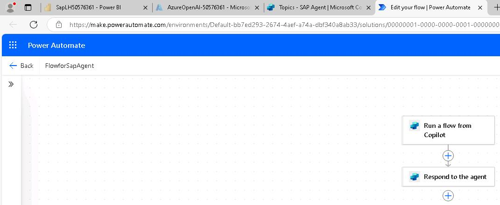

1. Select the **When an agent calls the flow** action.

1. In the pane that opens, select **+ Add an input**.

    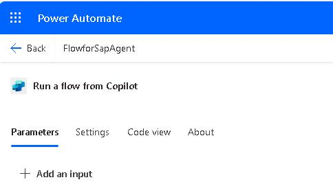

1. Select **Text**.

1. Change the text in the **Input** field to `CustomerName`.

    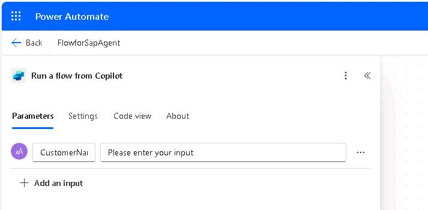   


1. Select the **Add node** button under the **When an agent calls the flow** action. Search for and select the `Run a query against a dataset` action.

    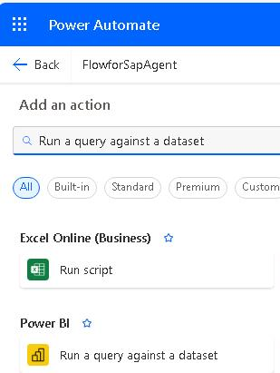

1. In the **Create Connection** pane, select **Sign in**. 

    {: .warning } 
	> You may see an error resembling the following screenshot. The message indicates that the browser cannot display the sign in dialog.
    >
    >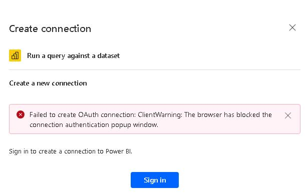
    >
    >If you see this error message, in Edge, select the ellipses (**...**) at the right side of the menu bar and then select **Settings**. Search for the **Pop-up** setting. Change the value of the **Blocked (recommended)** setting to **Off** and then repeat Step 37.
    > 
    >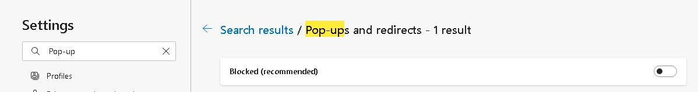

1. In the **Pick an account** dialog, select the **@lab.CloudPortalCredential(User1).Username**. 

1. Configure the **Run a query against a dataset** pane by using the values in the following table. Use default values for all the other settings.

    | Field | Value|
    |:---------|:---------|
    | Workspace   | **SapWS-@lab.LabInstance.Id**  |
    | Dataset   | **SapSemanticModel**   |

1. In the **Query text** field, paste in the following query:

    ```
    EVALUATE

    SUMMARIZECOLUMNS(
    SalesOrderSet[CustomerName],
    SalesOrderSet[CreatedAt],
    SalesOrderSet[BillingStatusDescription],
    SalesOrderSet[DeliveryStatusDescription],
    SalesOrderSet[GrossAmount],
    SalesOrderSet[TaxAmount],
    SalesOrderSet[NetAmount],
        KEEPFILTERS( FILTER( ALL( SalesOrderSet[CustomerName] ), SEARCH( "<Replace with CustomerName variable>", SalesOrderSet[CustomerName], 1, 0 ) >= 1 ))
    )
    ORDER BY 
    SalesOrderSet[CustomerName] ASC,
    SalesOrderSet[CreatedAt] ASC
    ```

    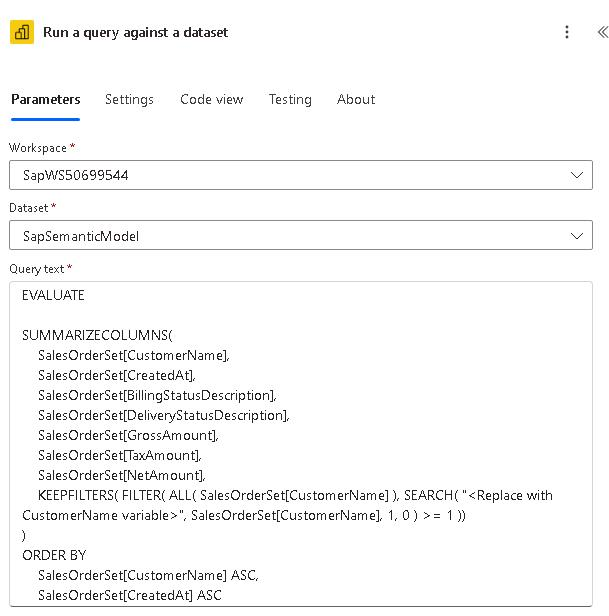

1. In the **Query text** section, select **&lt;Replace with CustomerName variable&gt;**. Then, select the lightning bolt icon. In the **When an agent calls the flow** section, select **CustomerName**. This replaces the placeholder text with a variable that represents the selected customer.

    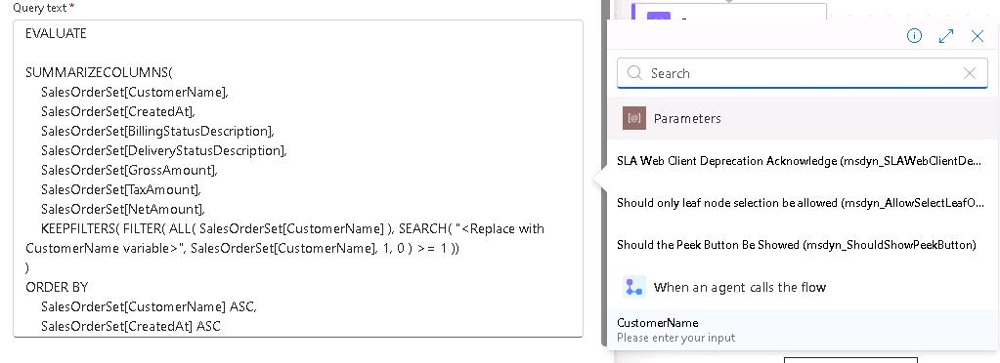

1. Select the **Add node** button under the **Run a query against a dataset** action. Search for and select the `Compose` action.

1. In the **Inputs** field, select the lightning bolt icon. In the list of options, in the **Run a query against a dataset** section, select **First table rows**.

1. Select the **Add node** button under the **Compose** action. Search for and select the `HTTP` action.
    
    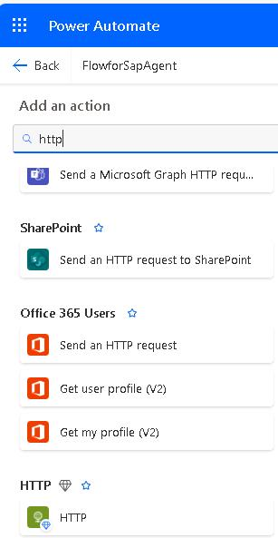

1. Configure the **HTTP** action by using the values in the following table. Leave all other options at their default settings.

    {: .note } 
	> You will be adding two headers. Each header consists of a key and a value. After you add the first header fields for a new key/value combination will display.
    >
    > The URI and api-key value that you supply configure the action to connect to the Azure OpenAI service instance that you provisioned earlier in the lab.

    | Field | Value|
    |:---------|:---------|
    | URI   | `@lab.Variable(OpenAIEndpoint)`   |
    | Method   | `POST`   |
    | Header key| `content-type`|
    | Header value | `application/json`|
    | Header key| `api-key`|
    | Header value | `@lab.Variable(OpenAIKey)`|

1. In the **Body** field, paste in the following text. 

    ```Text
        {
            "messages": [
                {
                    "role": "system",
                    "content": " summarize this content :<replace with output variable>. Add a header to the top of the response that includes the customer name. Use bold font for the customer name. Use markdown to present sales order records in a tabular format. Use a paragraph to display summary information for a customer."
                }
                        ]
        }
    ``` 

1. In the **Body** section, select **&lt;Replace with output variable&gt;**. Then, select the lightning bolt icon. In the **Compose** section, select **Outputs**. This replaces the placeholder text with a variable that represents the output from the Compose action.
    
    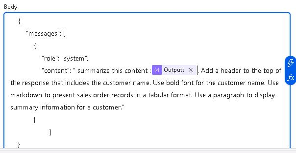
 
1. Select the **Respond to the agent** action. Select **+ Add an output** and then select **Text**.

1. In the **Enter a name** field enter `response`. 

1. Select the **Enter a value to respond with** field and then select the lightning bolt icon. In the **HTTP** section, select **Body**.

    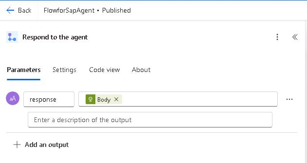
    
1. At the upper right of the **Power Automate** page, select **Save Draft**.

    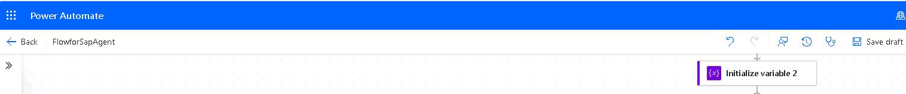

1. At the upper right of the **Power Automate** page, select **Publish**.

    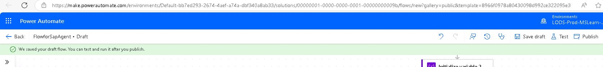

1. At the upper right of the **Power Automate** page, select **Test**.
    
    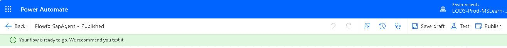

1. In the **Test Flow** pane, select **Manually** and then select **Test**.

    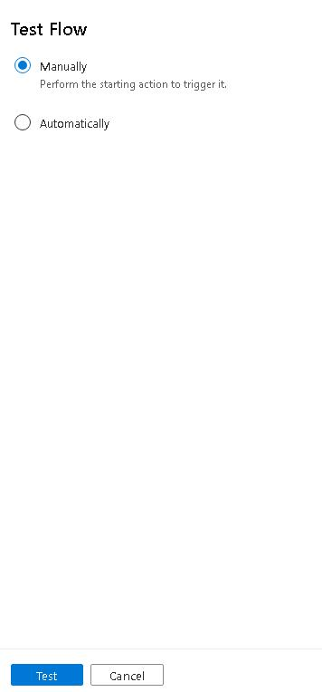

1. In the **Run flow** pane, in the CustomerName field, enter `PicoBit` and then select **Run flow**. 
    
    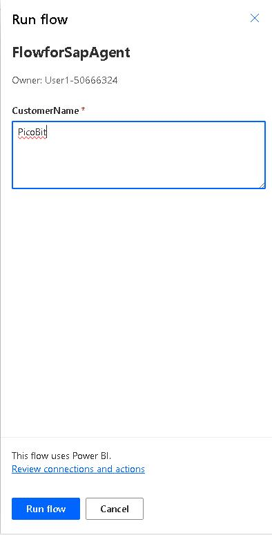

1. On the **Power Automate** page, in the **Run flow** pane, select **Done**.

    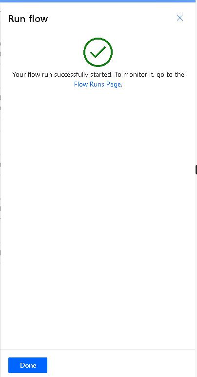

1. On the **Power Automate** page, verify that the message **Your run ran successfully** displays.

    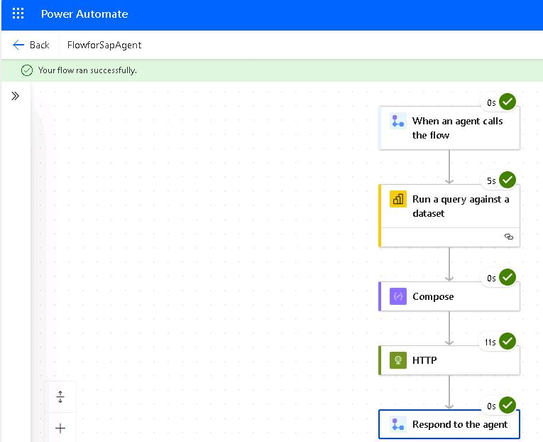

</details>

---

## Task 03: Complete the topic and test the agent

### Introduction

You've successfully created a Copilot agent. Now, you need to test the agent. 

### Description

In this task, you'll test the agent from within Copilot Studio to ensure that the agent returns expected results.

### Success criteria

-   The agent returns the expected results

### Key tasks

#### 01: Connect the flow to the agent and run tests

<details markdown="block"> 
  <summary><strong>Expand this section to view the solution</strong></summary>

1. Close the **Power Automate** page. You are returned to the Copilot Studio **Topic** page. If prompted, select **Done**.

    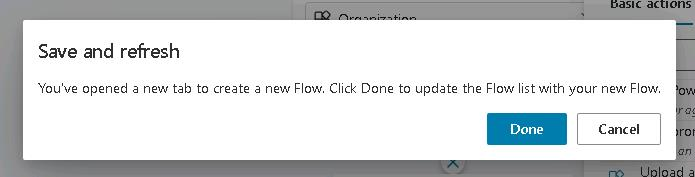

1. In the **Add an action** dialog, select **FlowForSapAgent**.

    {: .note } 
	> If you do not see **FlowForSapAgent**, save teh topic and then refresh the page.

    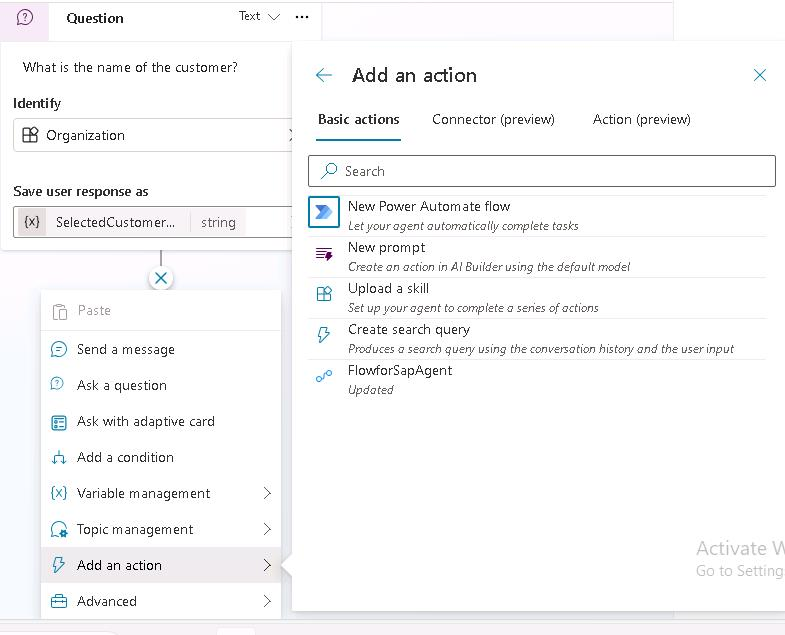

1. In the **Action** activity, in the **Enter or select a value** field, select **SelectedCustomerName**.

    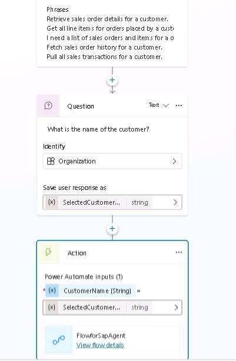

1. Select the **Add Node** button under the Action activity. Select **Send a Message**.

1. Select the **Insert variable** button (**{x}**). In the list of variables, select **response**.
    
    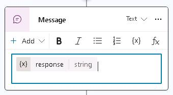

1. At the upper right of the SAP Agent page, select **Save** and then select **Test**.

    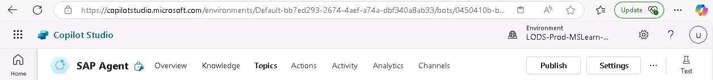

1. In the **Test your agent** pane, enter the following prompt and select the **Send** button.

    ```
    Get all sales transactions for a customer.
    ```

    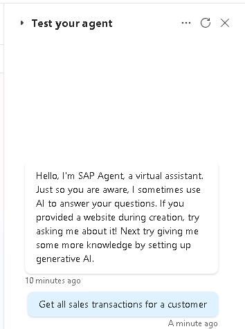

1. Enter **PicoBit** as the customer name. Be patient. For production agents, you will want to optimize the peformance of all elements of the agent.

    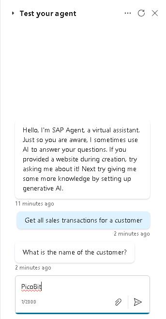

    {: .warning }
	> The first time you test the agent, you may see a message that resembles the message in the following screenshot.
    >
    >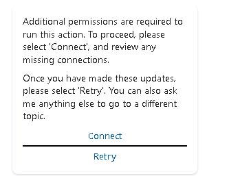
    >
    > If you see this message, select **Connect**. Then, on the **Manage your connections** page, select **Connect**.
    >
    >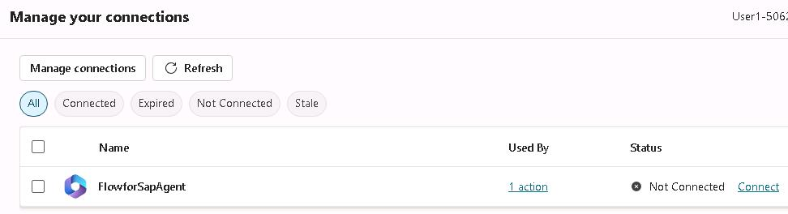
    > In the **Create or pick connections** dialog, select **Submit**.
    >
    >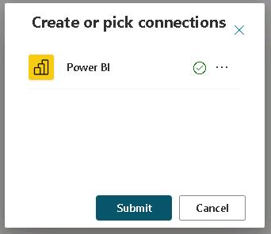
    > 
    > You should see that the status is *Connected*. Return to the Topics page and select **Retry**.
    >
    >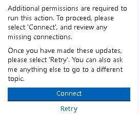

1. Review the response from the agent. The response may contain some extraneous information. You can adjust the inputs and outputs in the Power Automate flow to control and format the output.

</details>

---

### Congratulations!
You have completed this module!