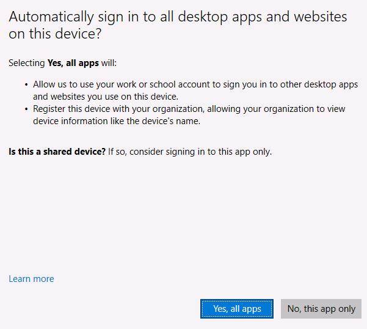
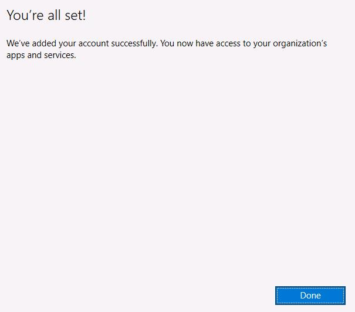
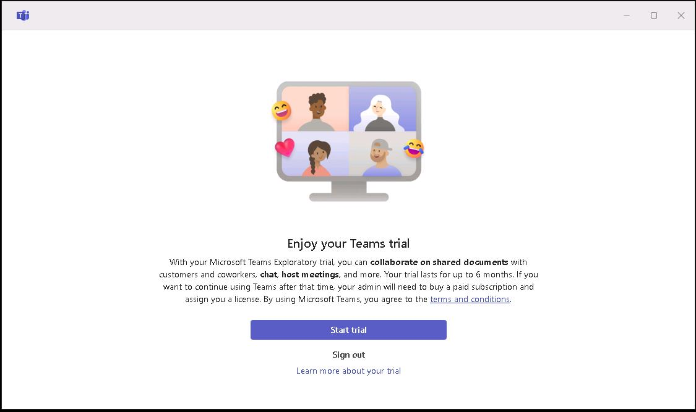
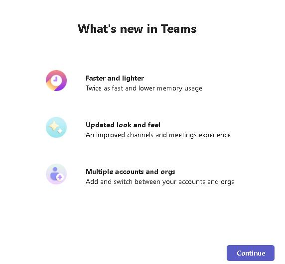
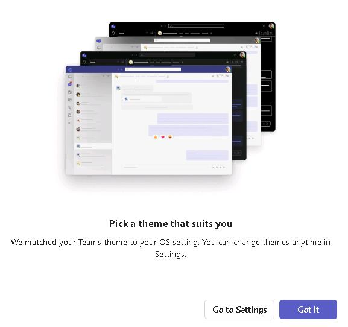

# Exercise 01: Set up resources for the lab

### Introduction
In this exercise, you'll configure apps and resources to support the lab.
After you complete this exercise, you will be able to:

- Configure Microsoft Teams for first use

### Duration
Estimated time to complete this exercise: 3 minutes

---

## Task 01: Configure Microsoft Teams

<!--estimated time for task completion: 3 minutes-->

### Introduction
SAP is a complex tool. In this lab, you will deploy an agent to Microsoft Teams. The agent will allow business users to ask questions about SAP data without needing to work in SAP.

### Description
In this task, you configure Microsoft Teams so that it is ready later in the lab when you deploy a Copilot agent to Teams.

### Success criteria

- You have succesfully signed into Teams

### Key steps

#### 01: Sign in to the lab VM and open Teams

1. Sign in to Microsoft Teams by using your credentials.

1. On the **Automatically sign in to all desktop apps...** page, select **Yes, all apps**.

    

1. On the **You're all set!** page, select **Done**.

    

1. On the **Enjoy your Teams trial** page, select **Start trial**.

    

1. On the **What's new in Teams** page, select **Continue**.

    

1. On the **Pick a theme that suits you** page, select **Got it**.

    

1. Leave the Microsoft Teams app open. You can minimize the app to keep it out of the way until you need the app later in the lab.