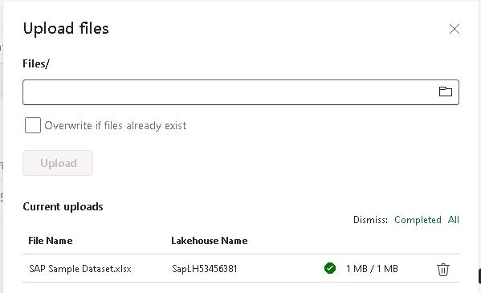
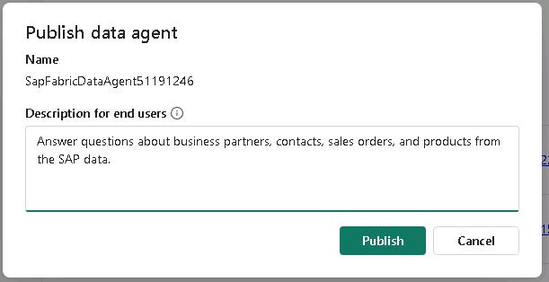

# Exercise 02: Create a Microsoft Fabric data agent

In this exercise, you create a Microsoft Fabric data agent. The agent uses an SAP sample dataset as a data source and uses a large language model to answer queries about the data.

After you complete this exercise, you will be able to:

- Create a Microsoft Fabric workspace
- Create a lakehouse in the workspace
- Create a Microsoft Fabric data agent

Estimated time to complete this exercise: 25 minutes

## Architecture


---

## Task 01: Create a Microsoft Fabric workspace and lakehouse

<!--estimated time for task completion: 5 minutes-->
### Introduction
Workspaces in Fabric are used to organize sets of resources for a specific project. After creating a workspace, you will create a lakehouse to store SAP data. You will also create a data agent.


### Description
In this task, you will create a workspace. You will also create a lakehouse to store the data that you import. For the process that you are using to import data in this lab, the lakehouse must already exist before you use it later in the exercise.


### Success criteria

- You have a Fabric workspace that includes a lakehouse.

### Key steps

#### 01: Create the Fabric workspace

1. Open a web browser and go to [Microsoft Power BI](app.powerbi.com). 

    {: .note }
    > If a dialog displays stating that browsing data is syncing across all devices, select **Got it** to dismiss the dialog.
    >
    > You may see a dialog alerting you that a Microsoft Fabric (Free) license has been assigned. You can safely dismiss this dialog. This lab includes automation that assigns you a paid Fabric capacity for the duration of the lab. The paid capacity is assigned as you create the workspace in the following steps.

1. If prompted, sign in with your credentials.


1. In the left navigation pane, select **Workspaces**.

    

1. In the Workspaces pane, select **+ New workspace**.

    

1. In the **Create workspace** pane, in the **Name** field, enter `SapWS@lab.LabInstance.Id`.

1. Select **Advanced**  to see how the workspace is configured. For this lab, you are assigned a paid Fabric capacity.

    

1. In the **Introducing task flows** dialog, select **Got it** to dismiss the dialog.

    

#### 02: Create the lakehouse in the workspace

1. On workspace page, select **+ New item**. Scroll down to the **Store data** section and then select **Lakehouse**.

    {: .important }
    > You can also use the **Filter by item type** field at the top of the **New item** page to locate a specific type of resource.
    >
    > 

1.  In the **New lakehouse** pane, in the **Name** field, enter `SapLH@lab.LabInstance.Id` and then select **Create**.
    
    {: .warning }
    > Ensure that the **Lakehouse schemas (Public Preview)** checkbox is not selected.

    

---

## Task 02: Import data into the lakehouse
<!--estimated time for task completion: 6 minutes-->

### Introduction
Microsoft Fabric provides many ways for you to import, transform, and store data. We have provided an SAP sample dataset that consists of data from five related tables. You will import this dataset to supply data for the Fabric data agent that you will create in Task 3.

### Description
In this task, you will import the SAP sample dataset file into the lakehouse that you created in Task 1.Then, you will transform the data into tables by using a Python script.

### Success criteria

- The lakehouse includes five tables that you imported from the SAP sample dataset.

### Key steps

#### 01: Upload the sample data in the lakehouse 

1. In the left navigation pane, select workspace **SapWS@lab.LabInstance.Id**.

    {: .important }
    > An alternative method is to select **Workspaces** in the left navigation pane and then select **SapWS@lab.LabInstance.Id**.

1. In the list of resources on the workspace page, select **SapLH@lab.LabInstance.Id**.

    {: .warning }
    > Select the lakehouse resource. Do not select the semantic model for the lakehouse or the SQL analytics endpoint.

    

1. In the **Explorer** pane for the lakehouse, hover your cursor over **Files** and then select the ellipses (**...**). 

    
    
1. Select **Upload** and then select **Upload files**.

    

1. In the **Upload Files** pane, select **Browse** (the folder icon).

    

1. In the File **Open** dialog that displays, go to the **Downloads** folder, select **SAP Sample Dataset.xlsx**, and then select **Open**.

    

1. In the **Upload Files** pane, select **Upload**.

    

1. Wait for the file upload process to complete.

    {: .note }
    > The file upload process generally takes less than one minute to complete. The **Upload files** pane displays a green checkmark next to the File Name when the upload is complete.

    

1. Close the **Upload files** pane.

1. In the **Explorer** pane, right-click **Files** and then select **Refresh**.

    

1. Verify that the **Files** pane displays and that **SAP Sample Dataset.xlsx** are listed. If you do not see the files pane, select **Files** again.

    

#### 02: Load the Excel sheets into tables via notebook

1. On the menu bar for the lakehouse, select **Open notebook** and then **New notebook**.

    

    {: .note }
    > If the **Enhance your notebook experience with AI tools** page displays, select **Skip tour**.

1. Paste the following code at line 03 of the code cell in the notebook. This code parses the Excel workbook and then writes each worksheet as a separate table in the lakehouse.

    ```
    import pandas as pd
    # Path to the uploaded Excel file in the Lakehouse
    excel_path = "/lakehouse/default/Files/SAP Sample Dataset.xlsx"
    # Load the Excel file
    xls = pd.ExcelFile(excel_path)
    # Loop through each sheet and save as a table
    for sheet in xls.sheet_names:
        df = xls.parse(sheet)
        spark_df = spark.createDataFrame(df)
        
        # Sanitize sheet name to be a valid table name
        table_name = sheet.strip().replace(" ", "_").replace("-", "_")
        
        # Write with schema overwrite enabled
        spark_df.write \
            .mode("overwrite") \
            .option("overwriteSchema", "true") \
            .saveAsTable(table_name)
    ```

    {: .note }
    > You can use the **Type** option in the instructions to stream the code to the code cell. You can also use **Copy** and then paste the code into the code cell. You may be prompted to allow pasting in the browser.

    {: .important }
    > The Python code first loads the Excel file into memory. Then, for each worksheet in the file, the code writes the contents to a data frame, cleans the data, and writes the data frame to a lakehouse table.

1. At the left of the code cell, select **Run** (the trianglge icon).

    

    {: .warning }
    > Compute sessions are automatically disconnected when idle for a specific period of time. 
    >
    > 
    >
    > If you get a message stating that the compute session was disconnected, on the menu bar, select **Connect** and then select **New standard session**. Then, select **Run** again.
    >
    > 

1. Wait for the code to complete. When complete, the code cell will display a check mark and total execution time.

    {: .note } 
    > t may take 1-2 minutes for code execution to complete.

    

1. In the **Explorer** pane, right-click **Tables** and then select **Refresh**. After refreshing, you should see the following tables listed:

    - business_partners
    - contacts
    - line_items
    - products
    - sales_orders

    


---

## Task 03: Create a Microsoft Fabric Data agent 

<!--estimated time for task completion: 6 minutes-->

### Introduction
Fabric data agents create conversational AI experiences that answer questions about data that is stored in lakehouses, warehouses, Power BI semantic models, and KQL databases. Users can ask questions in plain English and receive answers that are data-driven.

{: .warning }
> Creating Fabric data agents is in preview. The feature's availability and implementation details are subject to change. The instructions and screenshots may differ slightly from the current Fabric user interface.

{: .note }
> Check Module 1 of this TechExcel series for more information about how to ingest the data and an alternate method for ingesting data.

### Description
In this exercise, you'll create a Fabric data agent that connects to the SAP data that has been ingested into a lakehouse. 


### Success criteria

- You have created a Fabric Data agent
- The agent returns expected results from a sample prompt


### Learning resources

-   [Create a data agent](https://learn.microsoft.com/en-us/fabric/data-science/how-to-create-data-agent "Create a data agent")

### Key tasks

#### 01: Create the data agent and connect the lakehouse

1. In the left navigation pane, select the **SapWS@lab.LabInstance.Id** workspace.

1. At the upper left of the page, select **+ New item**.

    

1. In the **Analyze and train data** selection, select **Data agent (preview)**.

    

1. In the **Create data agent** dialog, enter `SapFabricDataAgent@lab.LabInstance.Id` and then select **Create**.

    

1. In the **Explorer** pane, select **+ Data source**.

    

1. In the OneLake catalog **Add a data source** dialog, select the **SapLH@lab.LabInstance.Id** lakehouse resource, and then select **Add**.

    

    {: .warning }
    > Be sure to select the Lakehouse resource and not the Semantic model.
    >
    > Wait while Fabric validates the connection. Fabric will not allow you to add a data source that cannot be validated.
    >
    > If validation fails, repeat Steps 5 and 6.


1. In the Explorer pane, expand the **SapLH@lab.LabInstance.Id** node and then expand the **dbo** node. Select all the tables:

    - Business Partners    
    - Contacts
    - Line Items
    - Products
    - SalesOrders
    
    

1. On the menu bar for the data agent, select **AI instructions**. The **AI instructions** pane opens.

    

1. In the **AI instructions** pane, paste in the following text: 

    ```
    You are a data agent that helps users answer questions about SAP product and sales data and assists with data exploration. You will access a Fabric lakehouse that includes the following six tables: Business Partners, Categories, Contacts, Line Items, Products, and Sales Orders. You are intended to be used by business users, data analysts, and executives.

    Ensure that responses are concise, relevant, and based only on available data sources. If a query is ambiguous, ask clarifying questions before proceeding. Format responses in a structured manner, using tables or bullet points when necessary.
    ```
    {: .important }
    > The AI instructions help the data agent understand the structure of the data and how to handle queries. You can include up to 15,000 characters in the AI instructions pane.

    

1. Close the **AI instructions** pane.

1. On the menu bar for the data agent, select **Example queries**.

    

1. In the **Example queries** pane, select **Add or edit example queries** (the pencil icon).

    

    
1. In the **Example SQL queries** dialog, select **Import from .json**.

    {: .important }
    > Fabric allows you to create example queries one at a time. You supply a question and the corresponding query. You can also import a JSON file that includes a series of questions and queries.

    

1. Go to the **Downloads** folder. Select **SapSQLExamples.json** and then select **Open**.

    

1. Review the questions and SQL queries and then close the **Example SQL queries** pane.

    {: .note }
    > Fabric validates the example queries after import. You must resolve any issues that Fabric identifies before you can save the queries and close the **Example SQL queries** page.

    {: .important }
    > To create the example queries, we used the SQL analytics endpoint in the lakehouse. Select the workspace, and then in the list of resources, in the lakehouse node, select the SQL analytics endpoint. Then, on the menu bar, select **New query**. Once you create the queries you can add them to the JSON file.
    >
    > 


---

## Task 04: Test and publish the data agent 

<!--estimated time for task completion: 6 minutes-->

### Introduction
Now that you have created the data agent, you must publish the agent to make it available in Copilot Studio. You will also test the agent to ensure that it generates appropriate results.


### Description
In this exercise, you will test and publish the Fabric data agent that you created in Task 3.


### Success criteria

- The agent returns expected results from a sample prompt

### Key tasks

#### 01: Test the data agent and then publish it

1. On the agent page, select the **What are the historical trends across all my data?** tile. 

    {: .note }
    > If you do not see the tiles on the data agent page, on the lower right side of the page, select **Sample questions** to see the list of sample questions that Fabric generated.

    

1. Select the **Send** button (right-facing triangle) and review the results. The results should resemble the following screenshot:

    

1. On the agent page, enter the following prompt and then select the **Send** button:

    ```
    Show me all of the sales orders for the customer Sorali. Format the GrossAmount and NetAmount columns as currency.
    ```

1. Review the results. The results should resemble the following screenshot:

    
    
1. On the menu bar for the agent, select **Publish**.

    

1. In the **Publish data agent** dialog, in the **Description for end users field**, enter the following description and then select **Publish**:

    ```
    Answer questions about business partners, contacts, sales orders, and products from the SAP data.
    ```

    

1. At the upper right of the agent page, select **Published** to switch from the draft version of the agent to the published version.

    

1. On the menu bar for the agent, select **Settings** (the gear icon).

    

1. In the **SapFbricDataAgent@lab.LabInstance.Id** dialog, select **Publishing**.

    

1. Review the **Published URL** field. Paste the workspace identifier and the agent identifier from the URL into the following text fields. You'll use this information later in the lab to connect to the agent.

    - Workspace identifier: @lab.TextBox(WorkspaceID)
    - Data agent identifier: @lab.TextBox(AgentID)

    {: .note }
    > In the **Published URL** field, the URL includes the identifiers for the workspace and the data agent. The URL should resemble the following:
    >	
    > `https://api.fabric.microsoft.com/v1/workspaces/36297d23-131a-4930-8392-55653865d834/aiskills/92a15ff0-2c05-488b-99b2-a81dde46626c/aiassistant/openai`
    >
    > In this example, the Workspace identifier is **36297d23-131a-4930-8392-55653865d834**, and the  Data agent identifier is **92a15ff0-2c05-488b-99b2-a81dde46626c**.
    
---