# Exercise 03: Create a Copilot agent

## Introduction
Fabric Data agents make it easy to build agents that users can interact with to learn about data in a Fabric lakehouse. For this lab, we want to surface an agent in Microsoft Teams. Fabric data agents do not support this functionality yet.

Estimated time to complete this exercise: 20 minutes

## Architecture

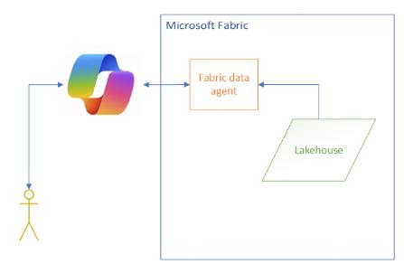

===

## Task 01: Create and share a Copilot agent

<!--estimated time for task completion: 4 minutes-->
    
### Introduction

You need to create a Copilot agent that connects to Fabric and then publish the Copilot agent to Teams. Microsoft is working on a way to directly connect Copilot agents to Fabric (by using a Fabric Knowledge source connector), but this feature is not generally available yet.

### Description
In this task, you'll create the Copilot agent. 

### Success criteria

- You've created a Copilot agent.


### Learning resources

-   [Build Copilot agents](https://learn.microsoft.com/en-us/microsoft-365-copilot/extensibility/copilot-studio-agent-builder-build "Build Copilot agents")


### Key tasks

### 01: Sign in and start creating a new agent 

1. Open a web browser and go to [Copilot Studio](http://www.copilotstudio.com/). If prompted, sign in with your credentials

    {: .warning }
    > You will see two **Sign in** buttons at the top right of the **Copilot Studio** page. The top button is to sign into Microsoft Edge. The lower button is to sign in to Copilot Studio. Be sure to use the bottom **Sign in** button.
    >
    > 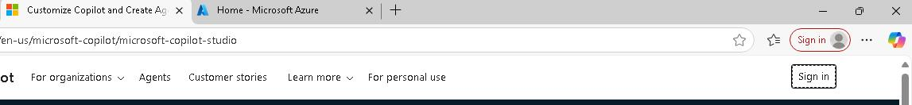
    
1. Select **Start free trial**.

    {: .warning }
    > When you launch Copilot Studio for the first time, it can take a couple of minutes to get things ready. If you do not see the **Start free trial** dialog after a couple of minutes, skip to Step 4. That action will generally cause the **Start free trial** dialog to display.

    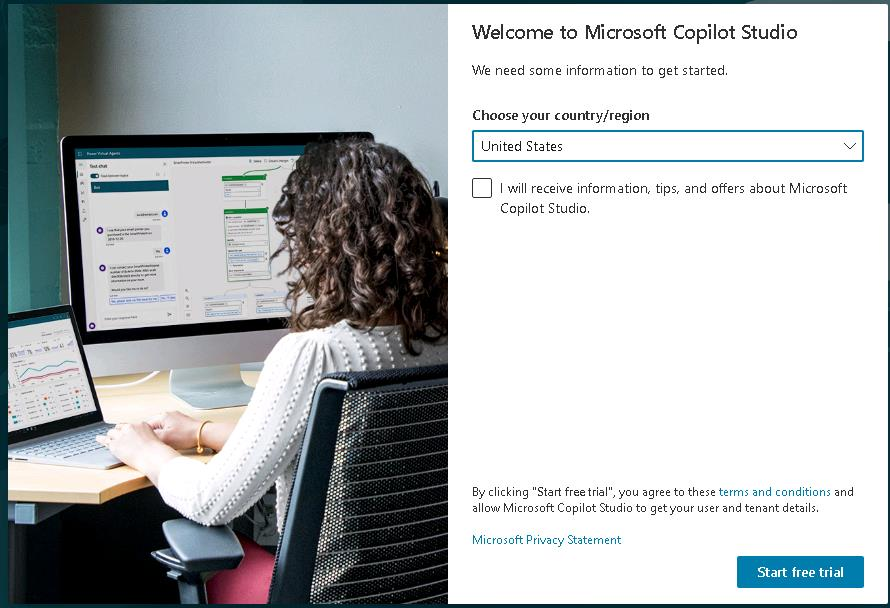

1. In the **Welcome to Copilot Studio!** dialog, select **Skip**.

    

1. In the left pane, select **Create**.

    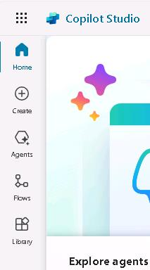	

1. On the **Create** page, select **+ New agent**.

    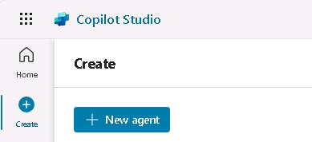

    {: .warning }
    > You may see an error message that resembles the following screenshot. If you see an error message, wait a few minutes and then repeat Step 4 of this task.
    >
    > 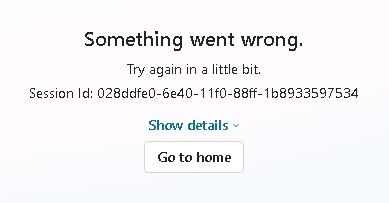

1. In the **Type your message** field, enter the following text and then select **Send**. Wait for Studio to load a response to your prompt.

    {: .warning }
    > Copilot is evolving at a fast pace. The questions that you are asked and the order in which questions are asked may differ from what you see in the instructions.

    ```
    Create an agent that allows users to interact with Product, Sales, and Customer information from a Microsoft Fabric Data agent.
    ```

1. In the *Type your message* field, enter the following text and then select **Send**. Wait for Studio to load a response to your prompt.

    ```
    Use the name "SAP Agent".
    ```
        

1. In the **Type your message** field, enter the following text and then select **Send**. Wait for Copilot Studio to load a response to your prompt.

    ```
    Respond in a friendly and professional manner. Use tables to present data when appropriate. Provide data summaries and reports when appropriate. Don't use publicly accessible data sources. Only use data from the Microsoft Fabric lakehouse that we'll specify.
    ```

1. At the upper right of the Copilot Studio page, select **Create**.

    {: .note }
    > It may take a few minutes to set up your agent.

    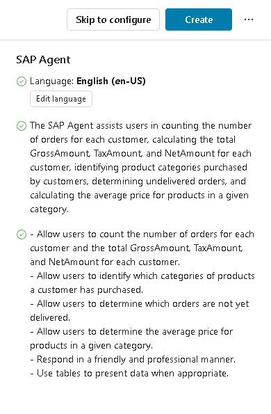

---

## Task 02: Configure and test the Copilot agent

<!--estimated time for task completion: 5 minutes-->

### Introduction
Now that you have created a Copilot agent, you can perform some configuration steps to make it more useful. 

### Description
In this task, you'll connect the Copilot agent to the Microsoft Fabric data agent that you published in Exercise 01. Then, you'll submit a prompt to ensure that the Copilot agent returns results.


### Success criteria

- You've tested the agent and returned results.


### Learning resources

-   [Connect and configure an agent for Teams](https://learn.microsoft.com/en-us/microsoft-copilot-studio/publication-add-bot-to-microsoft-teams "Connect and configure an agent for Teams")

### Key tasks

#### 01: Add Microsoft Fabric extension and connect SapFabricDataAgent

1. On the **SAP Agent** page, on the menu bar, select **Agents**.

    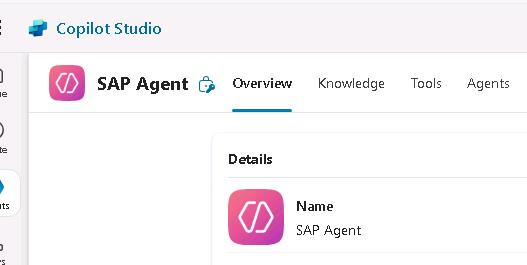

    {: .warning }
    > Integrating Fabric data agents and Copilot agents within Copilot Studio is in preview. The features available and implementation details are subject to change. The instructions and screenshots may differ slightly from the current Copilot Studio user interface.

1. On the **Agents** page, select **+ Add**.

    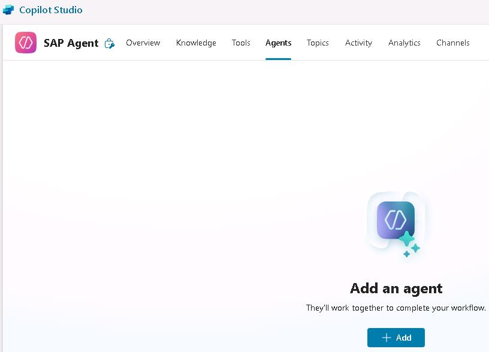

1. On the **Choose how you want to extend your agent (preview)** page, select **Microsoft Fabric**.

    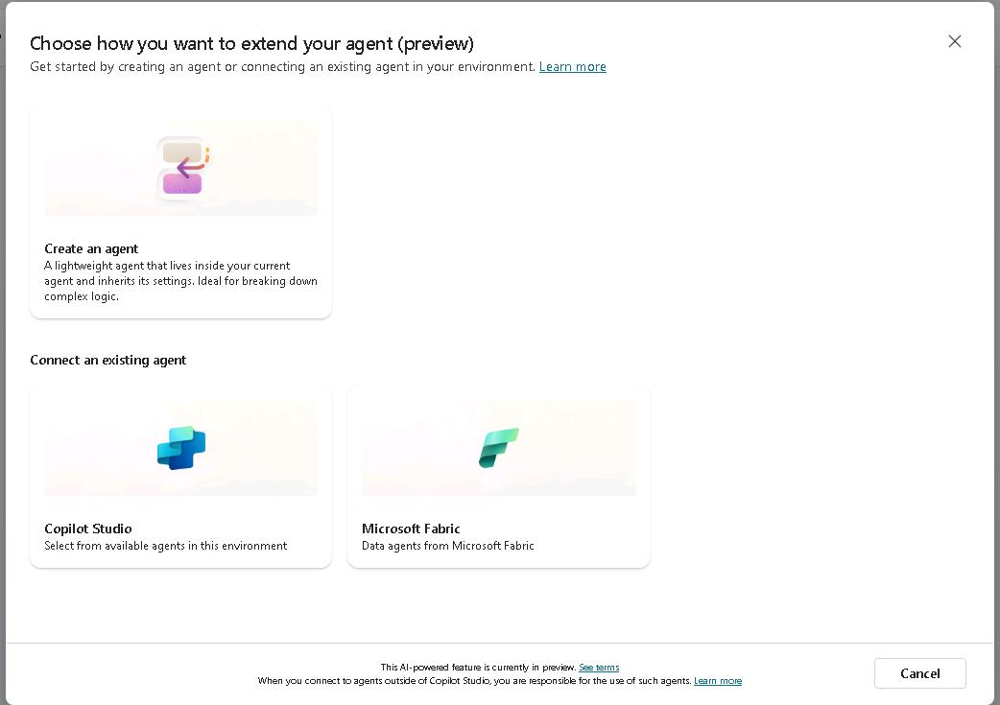

1. On the **Connect Microsoft Fabric data agents** page, to the right of **Connection**, select the dropdown arrow and then select **Create new connection**.

    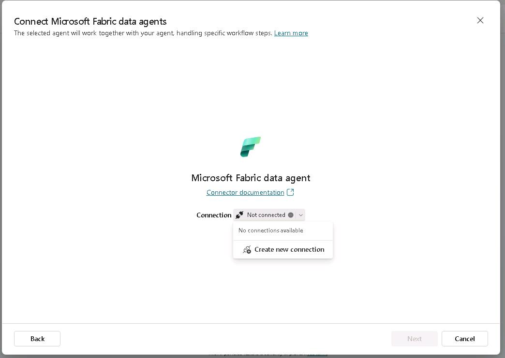

1. On the **Connect to Fabric data agent** page, select **Create**.

    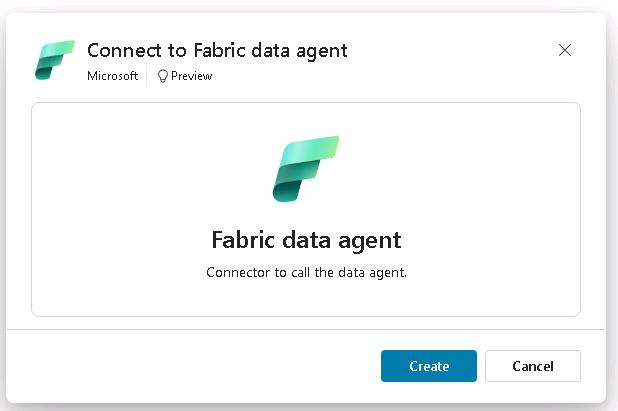

1. In the **Pick an account** dialog, select **@lab.CloudPortalCredential(User1).Username** or sign in by using your credentials:
 

1. After sign in is completed, select **Next**.

    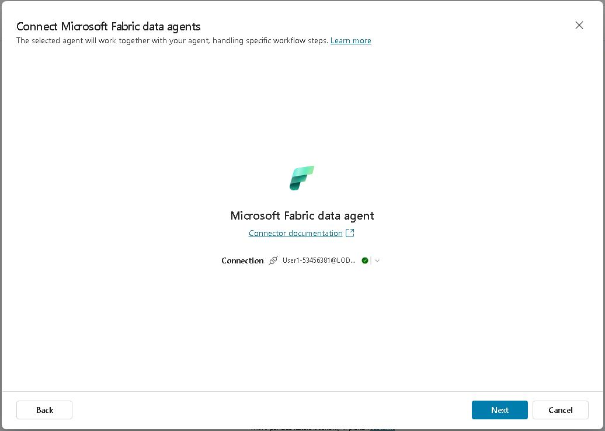

1. On the **Select agent to connect** page, select **SapFabricDataAgent@lab.LabInstance.Id** and then select **Next**.

    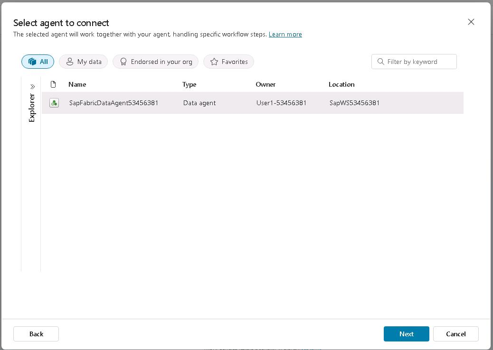

1. On the **SapFabricDataAgent@lab.LabInstance.Id** page, select **Add agent**.

    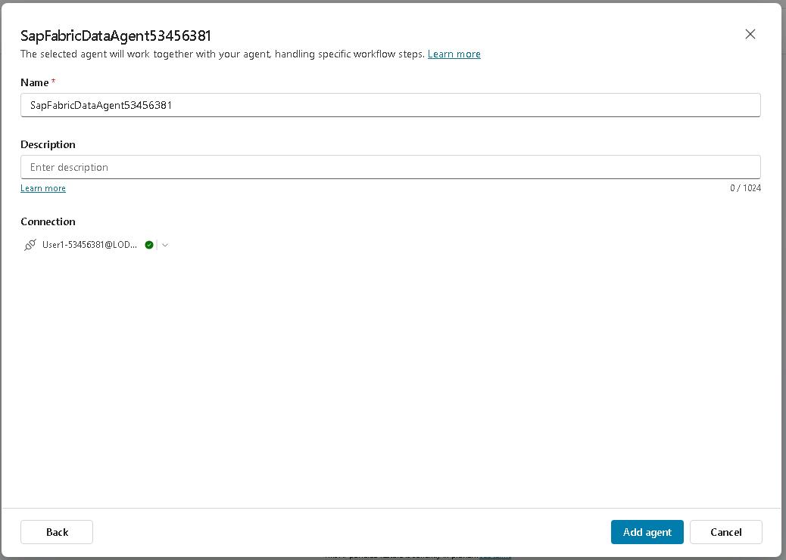

#### 02: Test the agent connection and response

1. On the menu bar for the agent, select **Test**. This displays the **Test** pane.

    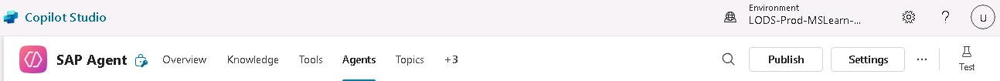

1. In the **Test** pane, enter the following prompt and then select the **Send** button:

    ```
    Show me all of the sales orders for the customer Sorali. Format the GrossAmount and NetAmount columns as currency.
    ```

    {: .note }
    > This is the same prompt that you used to test the Microsoft Fabric data agent in Exercise 01, Task 04, Step 03.

    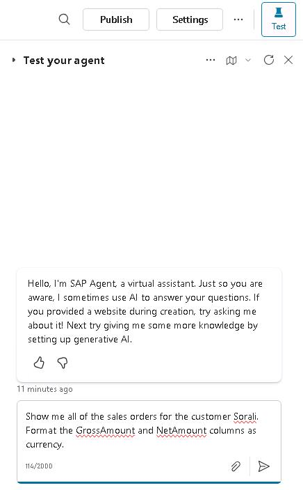

1. In the **Test** pane, in the **Connect to continue** section, select **Allow**.

    {: .note }
    > When you first connect to a data source (or after a period of inactivity), Copilot Studio will prompt you to allow a connection to a data source.

    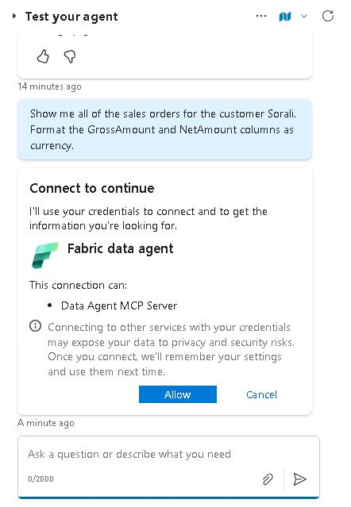

1. Wait while copilot Studio connects to Microsoft Fabric and processes the prompt. 

    {: .note }
    > For the first prompt this process may take 1-2 minutes. 
    >
    > If after a few minutes you do not see results, on the menu bar for the **Test** pane, select the **New conversation** icon and then resubmit the prompt.
    >
    > 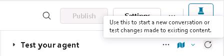

    {: .important }
    > Copilot Studio will display an activity map on the left side of the agent page to show you the process that it is using to respond to your prompt.
    >
    > 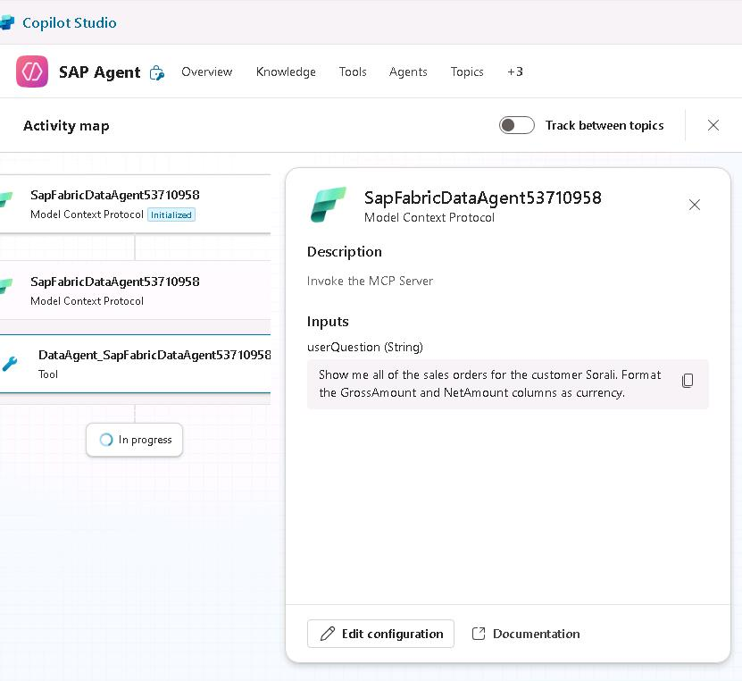

1. Review the results in the **Test** pane. The results should resemble the results you obtained in Exercise 01, Task 04, Step 03.

---

## Task 03: Publish and test the Copilot agent

<!--estimated time for task completion: 3 minutes-->

### Introduction
You now have a Copilot agent that connects to Microsoft Fabric to answer questions about the SAP data. Now, you need to configure and publish the agent so that you can view and test the agent in Microsoft Teams.

### Description
In this task, you'll configure the agent to use the Teams and Microsoft 365 channel. You will view the agent in Teams and test the agent to ensure that it returns results.

### Success criteria

- The agent appears in Teams.
- The agent provides appropriate responses to queries about the SAP data.


### Learning resources

-   [Connect and configure an agent for Teams](https://learn.microsoft.com/en-us/microsoft-copilot-studio/publication-add-bot-to-microsoft-teams "Connect and configure an agent for Teams")

### Key tasks

#### 01: Publish agent and configure Teams channel 

1. On the menu bar for **SAP Agent**, select **Publish**.

    {: .note }
    > The **Publish** button is not enabled until the system completes the creation and startup process. If the **Publish** button is disabled, wait a couple of minutes and then refresh the page.

    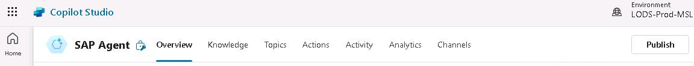

1. In the **Publish this agent** dialog, select **Publish**. Wait while the agent is published.

    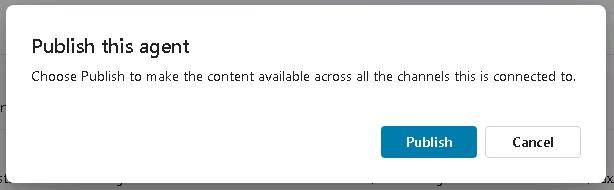

1. On the menu bar for **SAP Agent**, select **Channels**.

    {: .important }
    > By default, the agent is configured to use Microsoft authentication.

    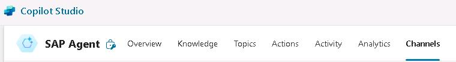

1. In the **Channels** section, select **Teams and Microsoft 365 Copilot**.

    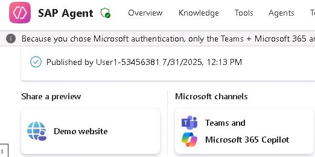

1. In the **Teams and Microsoft 365 Copilot** pane, select **Add channel**.

    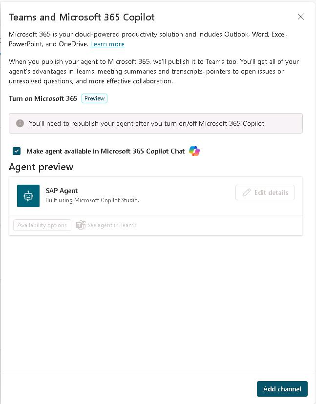

1. Once you see the message **The channel was added**, in the **Agent preview** section, select **Edit Details**.

    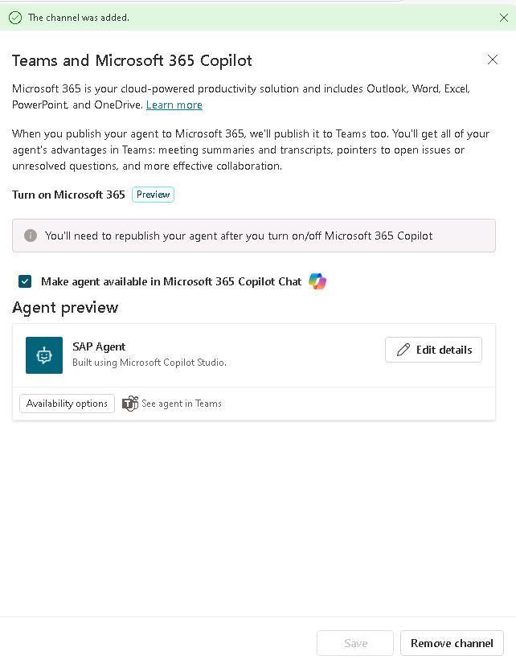

1. In the **Teams and Microsoft 365 Copilot** pane, select **Change icon**.

    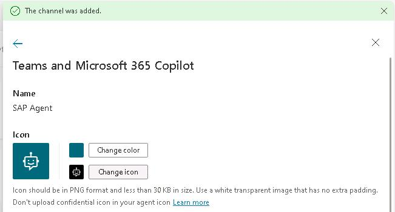

1. In the **Open** dialog, go to the **Downloads** folder, select **SAP Logo.png** an and then select **Open**.

    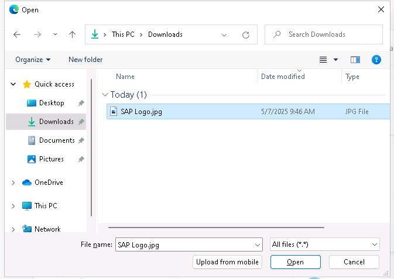

1. Configure the agent details by using the values in the following table. Leave all other settings at their default values.

    | Setting | Value |
    |:---------|:---------|
    | Short description  | `Interact with SAP Sales and Product data.`   |
    | Long description   | `Get data about customers, sales orders, sales order line items, and products using data sources ingested from SAP.`   |
    | Teams settings - Users can add this agent to a team  | Selected |
    
1. In the **Users can add this agent to a team** confirmation dialog that displays, select **Yes**.
    
    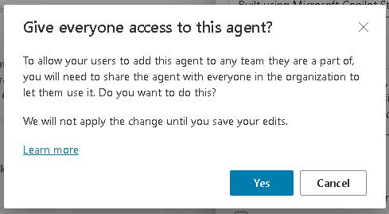

1. Select **Save**.
    
    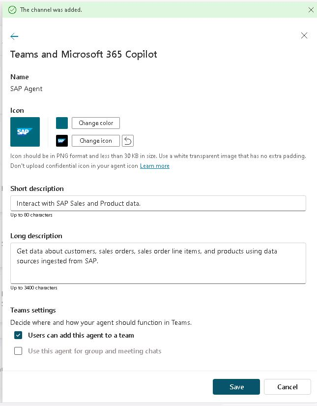

1. Close the **Teams and Microsoft 365 Copilot** pane.

1. On the menu bar for **SAP Agent**, select **Publish**.

    

1. In the **Publish this agent** dialog, select **Publish**. Wait while the agent is republished.

    

    {: .warning }
    > You may see a message stating **Your agent is shared with all users in the organization**. The message is prompting you to review whether or not you want to share with everyone. You can safely ignore the warning for this lab. You should consider your sharing policies if you plan to deploy agents in a production setting.
    >
    > 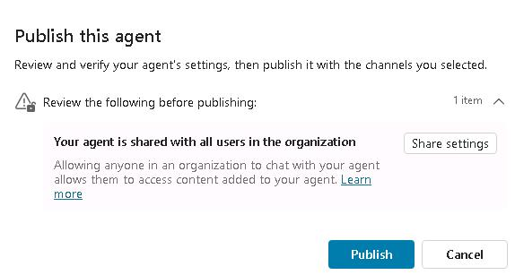

#### 02: Open the agent in Teams and test prompts

1. On the **Channels** tab for the agent, select **Teams and Microsoft 365 Copilot**.

1. In the **Teams and Microsoft 365 Copilot** pane, in the **Availability options** section, select **See agent in Teams**.

    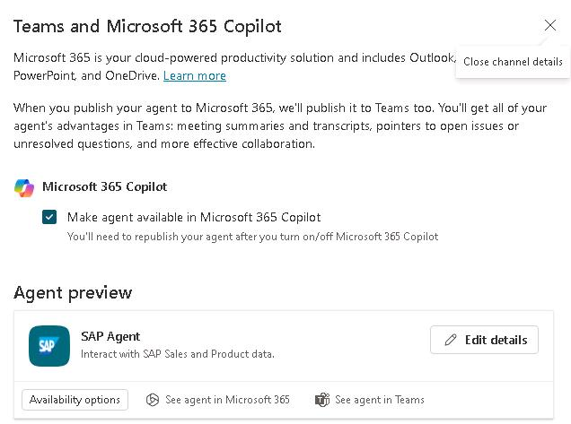
    
1. On the **Microsoft Teams** web page, in the **This site is trying to open Microsoft Teams** dialog, select **Open**.

    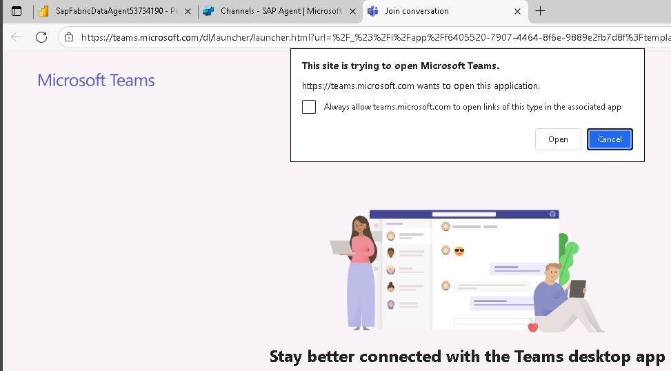

 1. On the **SAP Agent** page, select **Add**.

    {: .note }
    > It may take a minute or two to add the agent to Teams.

    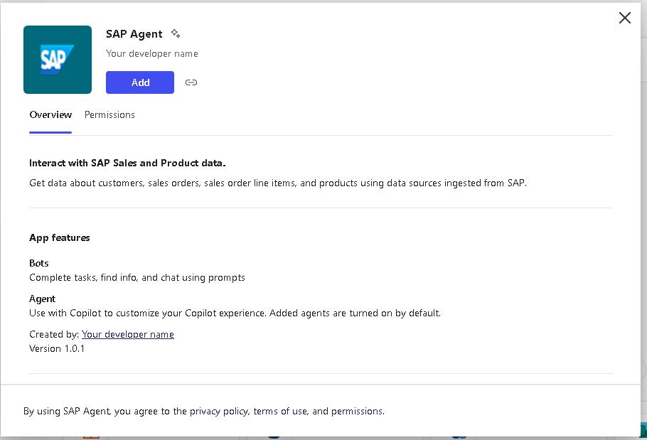

1. In the **SAP Agent** dialog, select **Open**.

    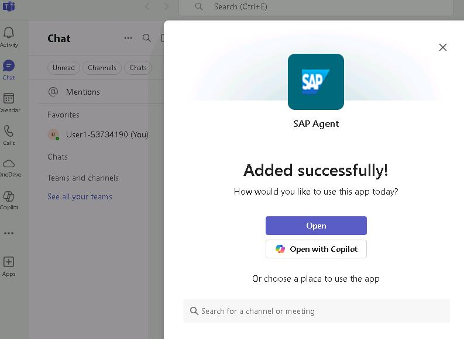

1. In Teams, in the left navigation pane, select **SAP Agent**.

    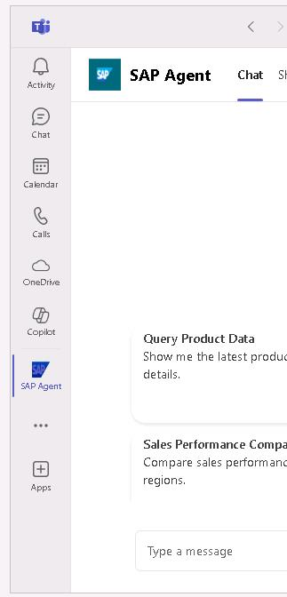

1. On the **SAP Agent** page, select the **Customer Insights** tile.

    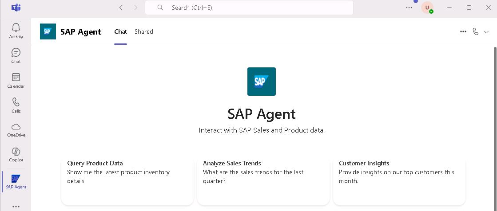

1. In the prompt window, review the prompt that is displayed and then select **Send** (the right-facing arrow).

    {: .note }
    > The first time you submit a prompt, the agent may provide a generic response that resembles the response in the following screenshot. If you see a similar response, resubmit your prompt.
    >
    > 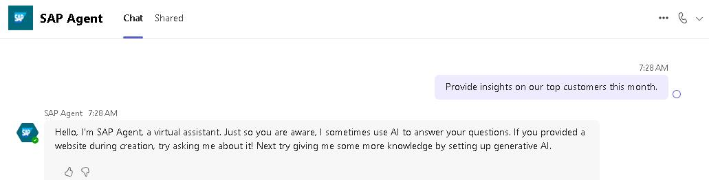
    
1. In the **Connect to continue** dialog that displays, select **Allow**.

    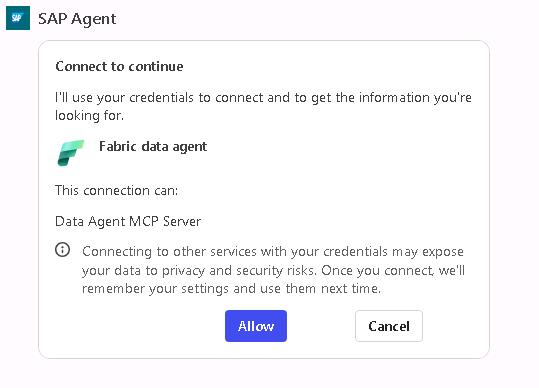

1. Review the response. This response is expected because the sample dataset does not contain transactions for the current month.

    

1. Enter the following prompt and then select the **Send** button:

    ```
    Show me all of the sales orders for the customer Sorali. Format the GrossAmount and NetAmount columns as currency.
    
    ```

    {: .note }
    > This is the same prompt that you used to test the Microsoft Fabric data agent in Exercise 01, Task 04, Step 03.

    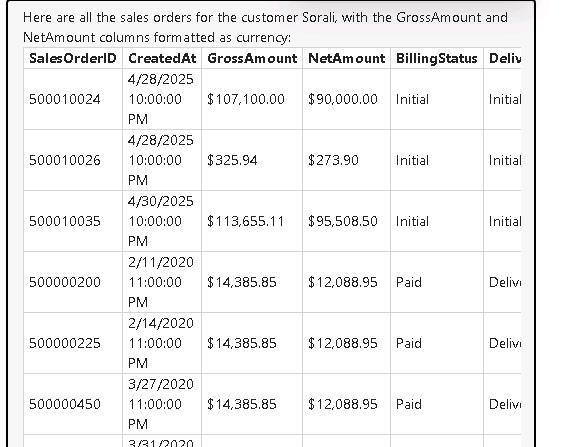

---

# Congratulations. You completed this module!

This was module two in a series of four modules. Continue your learning by working through the other modules in this series.

- TechExcel Migrate SAP to Azure: Module 3 - Demonstrate Sentinel for SAP 
- TechExcel Migrate SAP to Azure: Module 4 - Demonstrate Enterprise Insights options using SAP data