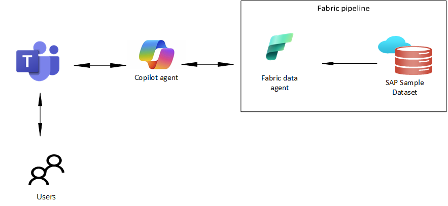

# Module 02: Showcase SAP Agentic AI capabilities through MS Teams to customers

## Introduction
In TechExcel Migrate SAP to Azure: Module 1 - Building AI Agents for SAP on Azure, you connected to SAP and imported data. 
In this lab, you'll focus on making the data more usable by business users.

You'll create a Fabric data agent that consumes the dataset and then connect to the data agent from a Copilot agent. After publishing the Copilot agent to Teams, users can ask questions about the SAP data from within Teams.

To reduce complexity and save time, in this lab you'll import a sample SAP dataset into a Microsoft Fabric lakehouse. 

## Architecture

## Data

This lab uses a sample dataset that was extracted from SAP. The dataset consists of five related tables. 

!IMAGE[Dataset.png](../../media/Dataset.png)

## Exercises

This lab has the following exercises:

 - Set up resources to support the lab
 - Create a Microsoft Fabric data agent
 - Create a Copilot agent

## Prerequisites

To run this lab you'll need:

- Access to Microsoft Fabric and Fabric capacity licensing
- Access to Azure and the ability to create resources including an Azure OpenAI Service instance
- Access to Copilot Studio to create Copilot agents
- Access to Microsoft Teams