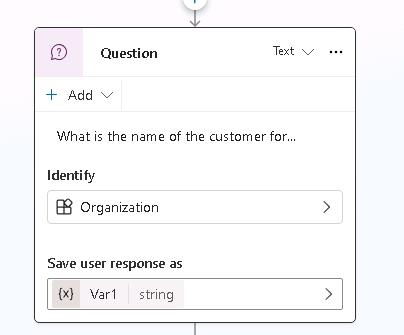
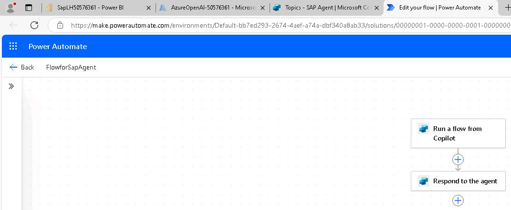
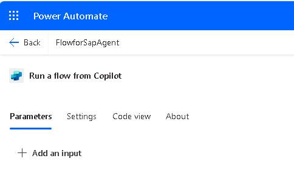
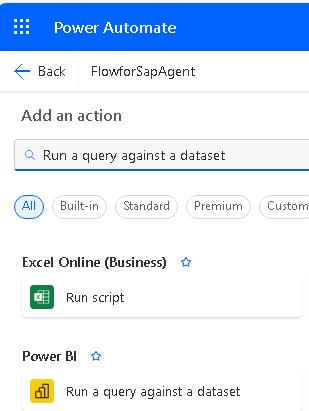
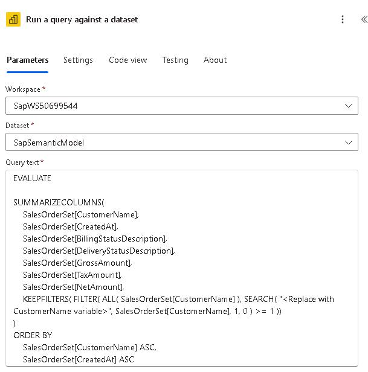
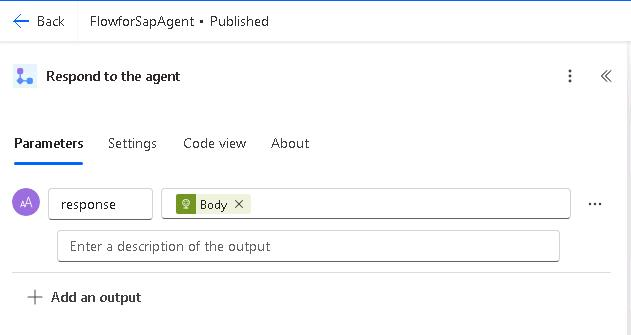
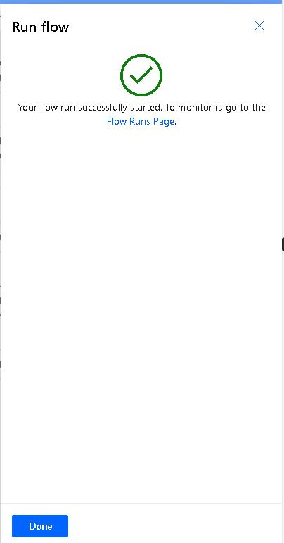

## Task 02: Configure the agent

## Introduction

You've successfully created a Copilot agent and created a lakehouse in Fabric. Now, you need to connect the agent to the data from SAP. 

In the near future you'll have many more ways to connect a Copilot agent to data. These include connecting the Copilot agent to a Fabric agent which in turn connects to the data.

## Description

In this task, you will create a topic that runs a Power Automate flow to retrieve data from the Fabric lakehouse.

## Success criteria

-   You've created and published a Power Automate flow
-   You've created a topic that uses the Power Automate flow

## Learning resources

-   [Create and edit topics](https://learn.microsoft.com/en-us/microsoft-copilot-studio/advanced-flow-create "Create Power Automate flows")
-   [Create Power Automate flows](https://learn.microsoft.com/en-us/microsoft-copilot-studio/authoring-create-edit-topics?tabs=webApp "Create and edit topics")

## Key tasks

### 01: Define the topic and triggers

<details markdown="block"> 
  <summary><strong>Expand this section to view the solution</strong></summary>

1. In Copilot Studio, in the menu bar for SAP Agent, select **Topics**.

    .

1. Select **+ Add a topic** and then select **From blank**.

    

1. At the upper left of the **SAP Agent** page, select **Untitled**. Replace the selected text with `AnswerUserQuestions` and then select the Enter key.
    
    

1. In the **Trigger** activity, in the Phrases section, select **Edit**.

    

1. In the **Phrases pane**, enter `Show me all sales orders for a customer` and then select **+** to add the phrase.

1. Repeat Step 5 to add each of the following phrases:

    - `Retrieve sales order details for a customer.`
    - `Get all line items for orders placed by a customer.`
    - `I need a list of sales orders and items for a customer.`
    - `Fetch sales order history for a customer.`
    - `Pull all sales transactions for a customer.`

    

    {: .note }
	> The phrases help the Copilot agent understand the different ways that users can ask for the same information. 

1. Close the Phrases pane by selecting the **X** at the upper right of the Phrases pane.

    

</details>

### 03: Build the Power Automate flow

<details markdown="block"> 
  <summary><strong>Expand this section to view the solution</strong></summary>

1. Select the **Add node** icon (**+**) under the Trigger activity and then select **Ask a question**.

    

1. In the **Enter a message** field, enter `What is the name of the customer?`.


1. Select the **Identify** field. In the **Choose information to identify** pane, select **Organization**.

    {: .note }
	> You may need to select the arrow (**>**) in the Identify field twice to see the **Choose information to identify** pane.

    

1. In the **Save user response as** field, select **Var1**. 

1. In the **Variable properties** pane, in the Variable name field, type `SelectedCustomerName`. Close the **Variable properties** pane. 

    

1. Close the **Properties** pane.

1. Select the **Add node** icon (**+**) under the Question activity. Select **Add an action** and then select **New Power Automate flow**.

    

1. At the upper left of the Power Automate window, select **When an agent calls the flow**. Replace the selected text with `FlowforSapAgent` and then select **Enter**.

    

1. Select the **When an agent calls the flow** action.

1. In the pane that opens, select **+ Add an input**.

    

1. Select **Text**.

1. Change the text in the **Input** field to `CustomerName`.

       


1. Select the **Add node** button under the **When an agent calls the flow** action. Search for and select the `Run a query against a dataset` action.

    

1. In the **Create Connection** pane, select **Sign in**. 

    {: .warning } 
	> You may see an error resembling the following screenshot. The message indicates that the browser cannot display the sign in dialog.
    >
    >
    >
    >If you see this error message, in Edge, select the ellipses (**...**) at the right side of the menu bar and then select **Settings**. Search for the **Pop-up** setting. Change the value of the **Blocked (recommended)** setting to **Off** and then repeat Step 37.
    > 
    >

1. In the **Pick an account** dialog, select the **@lab.CloudPortalCredential(User1).Username**. 

1. Configure the **Run a query against a dataset** pane by using the values in the following table. Use default values for all the other settings.

    | Field | Value|
    |:---------|:---------|
    | Workspace   | **SapWS-@lab.LabInstance.Id**  |
    | Dataset   | **SapSemanticModel**   |

1. In the **Query text** field, paste in the following query:

    ```
    EVALUATE

    SUMMARIZECOLUMNS(
    SalesOrderSet[CustomerName],
    SalesOrderSet[CreatedAt],
    SalesOrderSet[BillingStatusDescription],
    SalesOrderSet[DeliveryStatusDescription],
    SalesOrderSet[GrossAmount],
    SalesOrderSet[TaxAmount],
    SalesOrderSet[NetAmount],
        KEEPFILTERS( FILTER( ALL( SalesOrderSet[CustomerName] ), SEARCH( "<Replace with CustomerName variable>", SalesOrderSet[CustomerName], 1, 0 ) >= 1 ))
    )
    ORDER BY 
    SalesOrderSet[CustomerName] ASC,
    SalesOrderSet[CreatedAt] ASC
    ```

    

1. In the **Query text** section, select **&lt;Replace with CustomerName variable&gt;**. Then, select the lightning bolt icon. In the **When an agent calls the flow** section, select **CustomerName**. This replaces the placeholder text with a variable that represents the selected customer.

    

1. Select the **Add node** button under the **Run a query against a dataset** action. Search for and select the `Compose` action.

1. In the **Inputs** field, select the lightning bolt icon. In the list of options, in the **Run a query against a dataset** section, select **First table rows**.

1. Select the **Add node** button under the **Compose** action. Search for and select the `HTTP` action.
    
    

1. Configure the **HTTP** action by using the values in the following table. Leave all other options at their default settings.

    {: .note } 
	> You will be adding two headers. Each header consists of a key and a value. After you add the first header fields for a new key/value combination will display.
    >
    > The URI and api-key value that you supply configure the action to connect to the Azure OpenAI service instance that you provisioned earlier in the lab.

    | Field | Value|
    |:---------|:---------|
    | URI   | `@lab.Variable(OpenAIEndpoint)`   |
    | Method   | `POST`   |
    | Header key| `content-type`|
    | Header value | `application/json`|
    | Header key| `api-key`|
    | Header value | `@lab.Variable(OpenAIKey)`|

1. In the **Body** field, paste in the following text. 

    ```Text
        {
            "messages": [
                {
                    "role": "system",
                    "content": " summarize this content :<replace with output variable>. Add a header to the top of the response that includes the customer name. Use bold font for the customer name. Use markdown to present sales order records in a tabular format. Use a paragraph to display summary information for a customer."
                }
                        ]
        }
    ``` 

1. In the **Body** section, select **&lt;Replace with output variable&gt;**. Then, select the lightning bolt icon. In the **Compose** section, select **Outputs**. This replaces the placeholder text with a variable that represents the output from the Compose action.
    
    
 
1. Select the **Respond to the agent** action. Select **+ Add an output** and then select **Text**.

1. In the **Enter a name** field enter `response`. 

1. Select the **Enter a value to respond with** field and then select the lightning bolt icon. In the **HTTP** section, select **Body**.

    
    
1. At the upper right of the **Power Automate** page, select **Save Draft**.

    

1. At the upper right of the **Power Automate** page, select **Publish**.

    

1. At the upper right of the **Power Automate** page, select **Test**.
    
    

1. In the **Test Flow** pane, select **Manually** and then select **Test**.

    

1. In the **Run flow** pane, in the CustomerName field, enter `PicoBit` and then select **Run flow**. 
    
    

1. On the **Power Automate** page, in the **Run flow** pane, select **Done**.

    

1. On the **Power Automate** page, verify that the message **Your run ran successfully** displays.

    

</details>