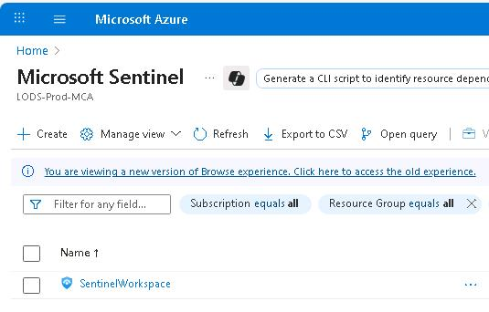
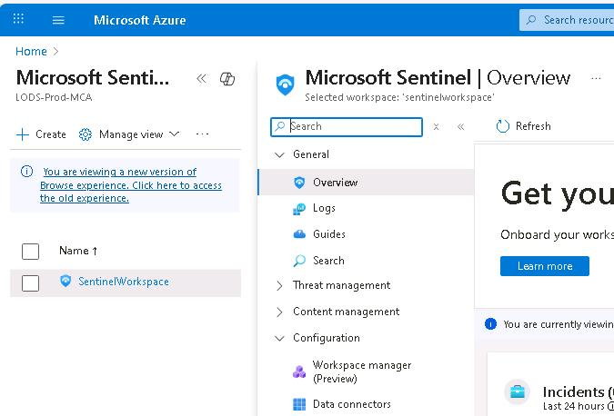
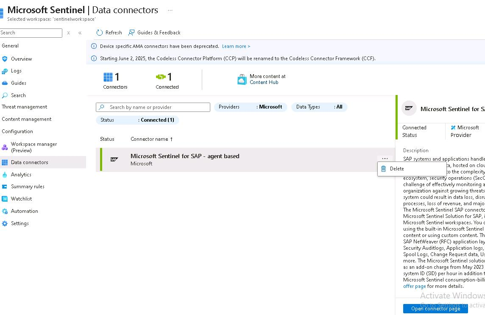
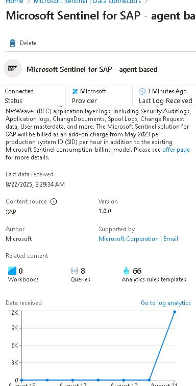
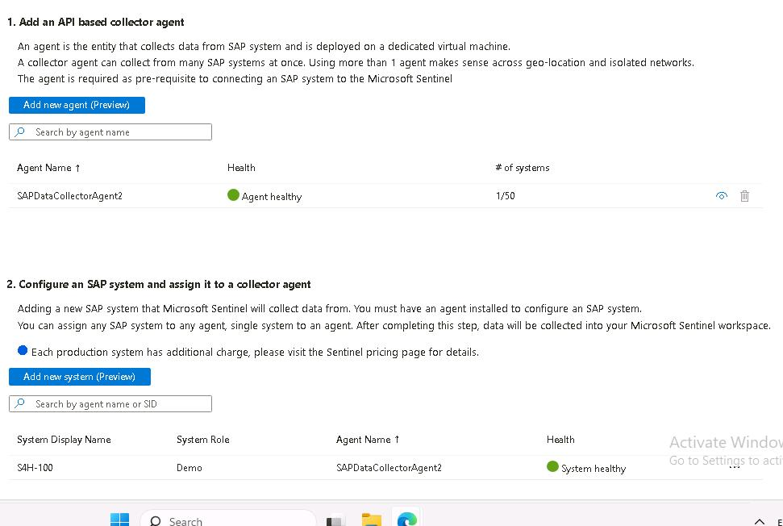
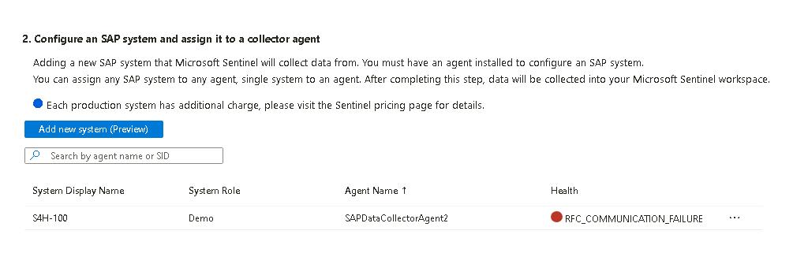
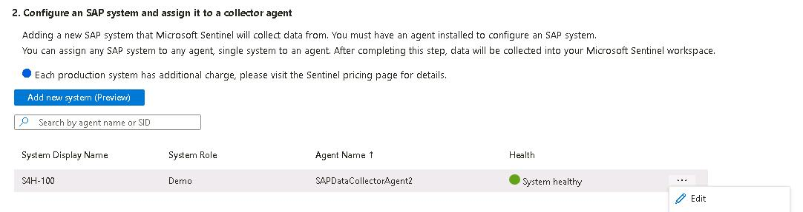
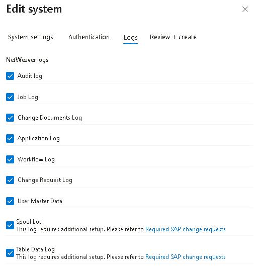

## Task 01: Explore the Sentinel data connector

### Description

In these steps, you'll explore the Microsoft Sentinel data connector specifically designed for SAP systems. You'll navigate through the Azure portal to locate the SAP data connector, review its configuration, and verify the health and connectivity of the agent-based setup. This ensures that log data from SAP is being correctly collected and made available for security analytics.

### Success criteria

- The SAP data connector is located and opened in Microsoft Sentinel.
- The agent health and connectivity status are reviewed.
- The connector is confirmed to be collecting logs from SAP systems.

### Learning resources

- [MS Learn: Check your data connectivity](https://learn.microsoft.com/en-us/Azure/sentinel/monitor-sap-system-health?pivots=connection-agent#check-your-data-connectors-health-and-connectivity)
- [MS Learn: Solution overview](https://learn.microsoft.com/en-us/azure/sentinel/sap/solution-overview)
- [Sentinel SAP promo](https://azure.microsoft.com/en-us/pricing/offers/microsoft-sentinel-sap-promo/) 

## Key tasks

1. At the top of the Azure portal page, in the **Search** field, enter **Sentinel**, then select **Microsoft Sentinel** from the dropdown menu.

	

1. Select the workspace titled **loganalyticsws4sap**. Then, on the workspace page, in the **Configuration** section, select **Data Connectors**.

	

1. Select **Microsoft Sentinel for SAP - agent based** and then, from the right blade, select **Open connector page**.

	

1. On the left pane, you'll find information about when the latest data was received, version, number of queries, and so on.

	

1. In the right pane, check the health of the agent in steps **1** and **2**.

	

	{: .warning }
	> If you recently started the VMs in Azure, you might observe health issues. For example, the following screenshot shows that the system has a communication failure. It can take 15-20 minutes for the SAP system to be fully live and communicating with the agent.
	>
	>

1. In the **Step 2** section, on the **S4H-100** system record, select the ellipses **...** and then select **Edit**.

	

1. Select **Next** twice on the **Edit system** page. Once you reach the **Logs** step, you'll find that the connector is configured to collect data from nine SAP log sources.

	
	
1. Select **Next** and then close this pane by selecting **X**.
