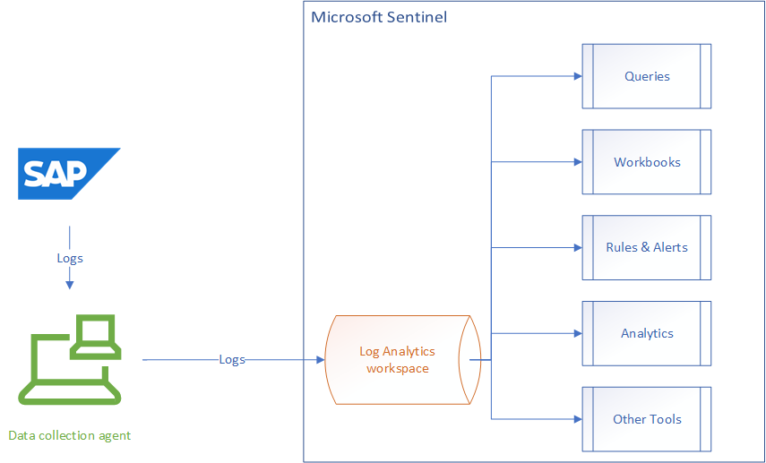
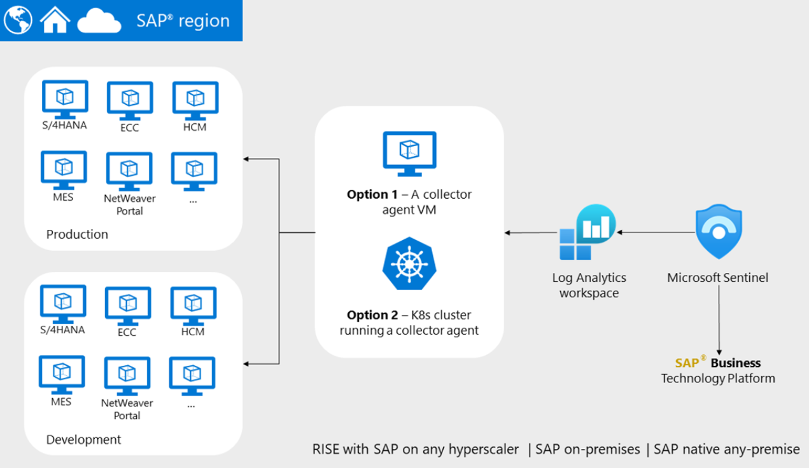
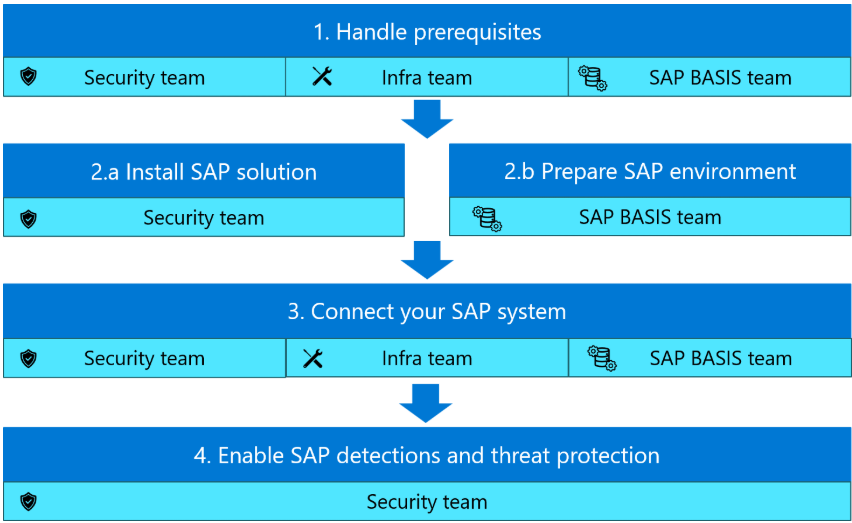

## Overview 

### Customer story

Contoso Electronics is a leading company that sells and distributes computer equipment and consumer electronics, including products like laptops, smartphones, and accessories. They supply both retail stores and directly serve business customers, making them an essential partner for many organizations. ​
Contoso Electronics wants to integrate SAP data with Copilot agents to enhance customer interactions and optimize their sales processes.

### Architecture
Microsoft provides **Sentinel solution for SAP applications**. There are two methods for deployment, agent-based and agentless. The agentless process is still in preview and requires special permissions. For this lab, we are using the agent-based deployment.

We performed some configuration steps in SAP (add roles, permissions, users, configure auditing) to allow SAP to output log data. We deployed Sentinel (including a Log Analytics workspace) and an agent to collect data. We congifured Sentinel and the agent to communicate with SAP. Here is the high-level architecture. The diagram shows some of the Sentinel features that we can use to query and visualize SAP log data.:

Here is an image from [MS Learn: Solution overview](https://learn.microsoft.com/en-us/azure/sentinel/sap/deployment-overview?tabs=agent). We are using option 1, the collector agent VM.

Here is another image from the same article. It details deployment steps and the typical teams involved in the steps. We previously deployed the SAP cloud appliance. For this lab we followed the steps listed to connect SAP and Sentinel.

### Reference
- This link is the overview for the overall solution: [MS Learn: Solution overview](https://learn.microsoft.com/en-us/azure/sentinel/sap/solution-overview)
